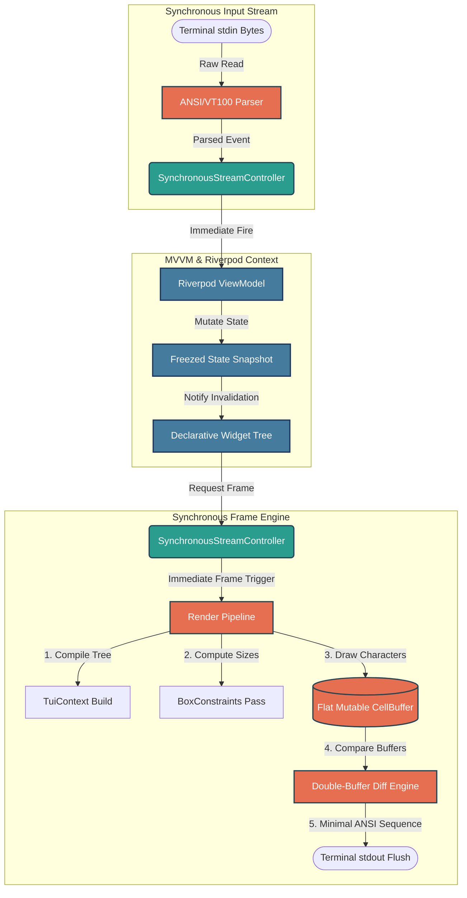
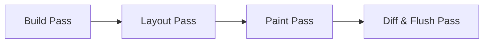
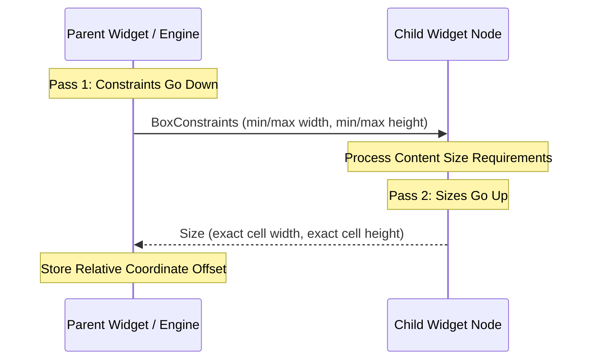

# Architectural and Technical Specifications: t22e TUI Framework

This document defines the formal system architecture, operational specifications, and binding mechanics for the `t22e` Terminal User Interface (TUI) framework. It establishes a high-performance, deterministic execution environment utilizing a single-package MVVM layout tied to a synchronous terminal engine.

---

## 1. The Synchronous MVVM Architecture & Flow Control

The framework strictly decouples data representation, operational logic, layout drawing, and low-level I/O manipulation into four distinct architectural layers bound together by immediate-execution synchronous channels.

### 1.1 The Synchronous MVVM Flow Control Graph

The diagram below illustrates how data and execution states flow through the engine in a single synchronous thread, keeping the ViewModels, Data States, and the Rendering Pipeline in lockstep.



### 1.2 Structural Layer Responsibilities

* **The Model Layer (Data Snapshots):** Constructed exclusively using immutable record definitions (Freezed). This layer holds pure, reactive snapshot representations of application data. It contains no business logic, layout dimensions, cell properties, or terminal text modifiers.
* **The ViewModel Layer (State Controllers):** Implemented via decentralized, reactive state providers (Riverpod Notifiers). ViewModels act as synchronous state machines managing application behavior, interpreting incoming parsed terminal events, and yielding modified immutable data models. They do not interact with drawing states, standard output, or ANSI escape codes.
* **The View Layer (Declarative Layouts):** Composed of immutable, declarative widget configurations. Widgets evaluate the immutable state snapshots emitted by ViewModels and compile a structural geometric representation of the user interface.
* **The Engine Layer (The Runtime Pipeline):** A highly optimized execution shell operating entirely outside the global reactive application graph. It intercepts raw terminal events, routes them to the synchronous input controller, tracks terminal screen geometry, manages frame drawing lifecycles, and handles double-buffered buffer transfers to standard output.

### 1.3 Unidirectional Synchronization Flow
Data operations follow an uninterrupted, synchronous loop path:
1.  **Ingress:** Terminal inputs feed directly into an ANSI byte parsing engine.
2.  **Dispatch:** The engine emits typed interaction actions immediately into an event distribution stream.
3.  **State Transformation:** ViewModels intercept actions, perform internal updates, and generate a new immutable state data model.
4.  **Tree Invalidation:** Dependency monitoring triggers an update in affected widgets, generating a modified structural layout scheme.
5.  **Egress Loop:** The framework schedules an immediate execution pass, calculating layouts, redrawing raw visual elements, calculating display adjustments, and executing terminal byte transfers.

---

## 2. Framework Core Project Structure

To prevent structural fragmentation and compilation dependencies across decoupled sub-systems, all framework mechanisms are combined inside a single monolithic core framework footprint.

```
lib/
├── t22e.dart               # Unified public API export barrel file
└── src/
    ├── engine/             # Low-level high-performance runtime
    │   ├── cell.dart       # Raw character & attribute layout primitives
    │   ├── cell_buffer.dart# 1D array coordinate management and manipulations
    │   ├── diff_engine.dart# Sequential delta matching algorithm
    │   ├── pipeline.dart   # Build, Layout, Paint execution loop
    │   └── scheduler.dart  # Microtask throttling and synchronization
    ├── models/             # Immutable Freezed application models
    │   ├── constraints.dart# Numeric layout limitations
    │   └── geometry.dart   # Coordinates, Dimensions, Attributes
    └── view/               # Declarative widget layers
        ├── components/     # Composition primitives (Flex, Row, Text, Consumer)
        ├── context.dart    # Scoped environment and provider bridges
        └── widget.dart     # Framework widget and engine node blueprints
```

---

## 3. Synchronous I/O Subsystems

To prevent asynchronous display rendering delays and remove visual tearing or input drops under rapid execution loads, the framework routes event loops through dedicated synchronous stream mechanics (`SynchronousStreamController`).

### 3.1 Input Stream Pipeline
Raw byte traffic captured from the system terminal interface streams instantly through a dedicated text parser to interpret terminal sequence commands. On confirmation of a command, the parser emits a specific interaction action into an input stream managed by a synchronous controller. 

Because of the nature of synchronous stream control mechanisms, listeners intercept and process this action within the identical execution thread. This forces application state updates, data validation checks, and frame scheduling hooks to clear sequentially on the same loop pass, removing internal runtime drift.

### 3.2 Output Loop Coordination
Widgets do not interact with standard system output channels. When a state update occurs within a reactive element, an interface draw request triggers a dedicated synchronous output controller. This controller instantly wakes the root engine drawing system to process the latest changes. 

If multiple separate state elements execute updates inside an identical operational block, an internal throttling filter intercepts redundant frame calls, collapsing them down into a single comprehensive interface draw pass.

### 3.3 Execution Guardrails
* **Reentrant Loop Restrictions:** State mutations inside ViewModels must follow a strictly forward direction. ViewModels are explicitly barred from generating actions that write directly back into the input stream controller. Breaking this rule will cause an unrecoverable system stack loop failure (StackOverflowError).
* **Isolation of Extended Operations:** Long-running system jobs, heavy background operations, and external network interactions must transition into dedicated asynchronous operations (Futures). When these processes complete, they step cleanly back onto the main execution path to process state changes safely.

---

## 4. The Rendering Engine Pipeline Lifecycle

The core engine lifecycle works independently from the application's state machines, acting like an optimized graphics processing framework to transform widget definitions into raw text commands.



### 4.1 Elements of the Structural Layout Context (`TuiContext`)
The layout context acts as an execution bridge passed down through layout definitions during processing passes. It contains:
* **State Graph Interface:** A direct pointer to the root state provider container, allowing widgets to safely check or monitor specific business logic nodes reactively during execution passes via specialized consumer layers.
* **Inherited Layout Parameters:** Top-down structural options including parent-level color assignments, text modifiers, visibility scopes, and environmental style configurations.
* **Tree Mutation Traps:** Explicit reference mechanisms that allow child sub-trees to pass structural execution events safely back up the parent path.

### 4.2 The Two-Pass Box Constraints Layout System
Terminal space layout checks use a strict integer-cell model following a predictable rule: **Constraints Go Down, Sizes Go Up**.



#### Pass 1: Constraints Pass (Downwards)
The layout processor delivers structural size boundary definitions down the layout structure. These boundaries dictate absolute minimum and maximum constraints for width and height measured in discrete, non-fractional terminal character units.

#### Pass 2: Dimension Assessment (Upwards)
* The receiving widget evaluates the incoming size constraints against its inner text elements, text wrapping boundaries, or fixed configuration settings.
* If a structural component contains multiple layout blocks (like a horizontal or vertical flex distribution sequence), it cycles through its non-flexible parts first. It asks these components to report their required dimensions under the current size boundaries.
* After checking fixed elements, the layout component divides any remaining character blocks among its flexible components.
* Each component completes its calculations and passes a definitive size result back up the structure to its parent container.
* The parent uses these values to calculate relative layout coordinates for every active asset, storing these positions securely in layout structure models.

---

## 5. Buffer Management and Delta Optimization

The primary bottleneck in any terminal user interface is text stream data transfer throughput over system I/O bounds. To maximize frame efficiency, the framework operates a specialized double-buffered verification engine.

### 5.1 Flat 1D Array Coordinate Structures
To completely prevent the system execution lag and reference fragmentation caused by tracking multi-dimensional nested lists, the engine operates on flat, pre-allocated vectors (`List<Cell>`). 

```
2D Matrix Representation (Width = 4, Height = 3):
[ (0,0) (1,0) (2,0) (3,0) ]
[ (0,1) (1,1) (2,1) (3,1) ]
[ (0,2) (1,2) (2,2) (3,2) ]

Flat 1D Vector Backing Array:
Index: 0   1   2   3   4   5   6   7   8   9   10  11
Cell:  0,0 1,0 2,0 3,0 0,1 1,1 2,1 3,1 0,2 1,2 2,2 3,2
```

Coordinate conversions run through direct mathematics:
* **Linear Index Transformation:** `Index = (Target Y * Grid Width) + Target X`
* **Spatial Axis Recovery:** `Target Y = Index ~/ Grid Width` and `Target X = Index % Grid Width`

### 5.2 Double-Buffering Mechanics
The engine allocates two identical tracking buffers at initialization: the `Current Display State` and the `Target Canvas Layout`. 
* **The Target Canvas Layout Buffer** behaves as a standard mutable grid. During drawing operations, layout elements write updates directly into this workspace.
* **The Current Display State Buffer** retains an exact copy of what is actively visible on the user's monitor.
* Cells inside these blocks use standard mutable definitions. Updates happen as in-place adjustments to properties like characters or text styling masks rather than allocating fresh objects, which prevents garbage collection overhead.

### 5.3 The Index-Matching Delta Verification Algorithm
When a frame completes its processing loops, the engine executes a sequential delta-matching check across both tracking buffers to generate clean updates:

1.  **Direct Index Comparison:** The engine compares components step-by-step from position zero up to the end of your grid array. If a cell's structural contents match perfectly, the loop steps forward instantly without generating update actions.
2.  **Cursor Jump Optimization:** When the loop encounters mismatched cell contents, it calculates the target spatial coordinates. The engine checks if these coordinates follow the cursor position from the previous loop pass. If the cursor is out of alignment, the system outputs an explicit cursor relocation command to target the exact update site.
3.  **Style Attribute Isolation:** The engine tracks active color and text modifier styles during comparison loops. If a target cell requires text styling that matches the current sequence state, it writes the character immediately. If styling properties differ, the engine applies an ANSI update sequence to adjust formatting controls before writing the character.
4.  **Sequential Tracking Updates:** After writing a character, the system automatically advances its cursor tracking index by one cell to maintain alignment for subsequent steps.

### 5.4 Defining TUI Rendering as an Atomic Operation
In this architecture, **rendering** does not describe raster graphical drawing or display tree transformations. Rendering represents the mathematical processing loop that reads changes between display states, maps differences into a highly efficient string of text bytes, and sends that sequence to standard system outputs in a single atomic transmission.

This optimization ensures that the terminal emulator only redraws changed cells, eliminating frame stuttering and providing clean updates at standard screen refresh rates.
