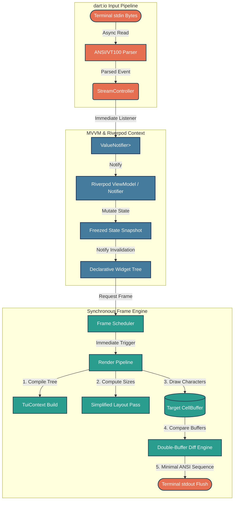
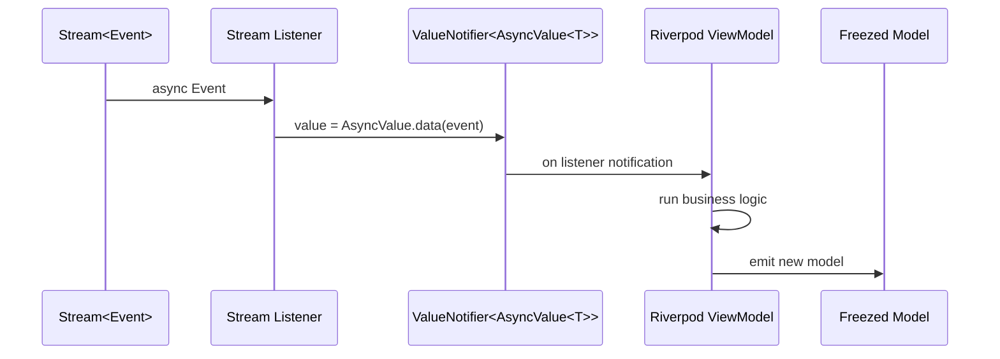
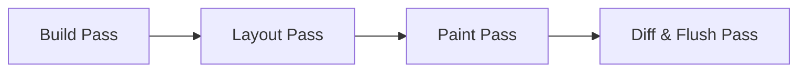

# Refined Architectural and Technical Specifications: t22e TUI Framework

This document refines the formal system architecture for the `t22e` Terminal User Interface (TUI) framework. It preserves the high-level vision of a deterministic, provider-driven, declarative TUI while incorporating concrete implementation decisions and constraining the first phase to a realistic, deliverable scope.

---

## 1. Purpose and Target

`t22e` is a **pure-Dart TUI framework**. It exposes a declarative widget layer backed by immutable state, managed through Riverpod providers, and rendered to a terminal via a flat cell buffer and diff engine.

The first public milestone is a **full-screen text widget** rendered through the complete pipeline. Advanced terminal features (raw mode, mouse, alternate buffer, etc.) are explicitly deferred.

---

## 2. Core Design Decisions

The following decisions override or clarify statements in the original specification.

| Topic | Decision |
|---|---|
| **Language & runtime** | Pure Dart, targeting the latest stable Dart SDK. No Flutter dependency. |
| **State management** | **Riverpod + Freezed** are mandatory. Code generation runs inside the package; framework users do not interact with `build_runner`. |
| **Stream semantics** | Use a normal asynchronous `StreamController`. The "synchronous" guarantee applies to the MVVM path: stream listeners immediately update a `ValueNotifier<AsyncValue<T>>` on the same event-loop turn. |
| **AsyncValue source** | The project uses a local clone of Riverpod's `AsyncValue<T>` (data/loading/error states). It is wrapped in a `ValueNotifier<AsyncValue<T>>`. |
| **Raw terminal mode** | **Not used** at this stage. Only `dart:io` stdin/stdout are used. The framework accepts the resulting input and performance limitations. |
| **Cell model** | `Cell` values are **immutable Freezed objects**. The flat buffer stores these values and copies them frame-to-frame. GC pressure will be measured in real-world use before considering mutable cells. |
| **Layout model** | Start with a **simplified layout pass**, not a full Flutter-style two-pass constraint engine. Complexity will be added only when justified. |
| **Public API surface** | Public functionality is exposed primarily through Riverpod providers. Internal engine classes and helper functions are marked `@internal` from `package:meta` and may be imported at the developer's own risk. |
| **Testing** | Unit tests only for this phase. Integration tests will be set up later. |
| **First deliverable** | A runnable **full-screen text widget** that reads stdin, updates state, and renders to stdout through the diff engine. |

---

## 3. Refined Synchronous MVVM Flow

The original flow is preserved but reinterpreted with correct Dart semantics.



### 3.1 Layer Responsibilities

* **Model Layer (Data Snapshots):** Immutable Freezed records holding pure application data. No business logic, layout, or terminal attributes.
* **ViewModel Layer (State Controllers):** Riverpod Notifiers that consume `AsyncValue<T>` events, run business logic, and emit new immutable models. They never touch stdin/stdout or ANSI codes.
* **View Layer (Declarative Layouts):** Immutable widget configurations that read model snapshots and compile a structural UI representation.
* **Engine Layer (Runtime Pipeline):** Reads terminal input, manages frame scheduling, runs build/layout/paint/diff/flush, and writes to stdout. It operates outside the application state graph except for reading model snapshots.

### 3.2 Unidirectional Flow

1. **Ingress:** `dart:io` stdin feeds bytes into an ANSI parser.
2. **Dispatch:** The parser emits typed events into an async `StreamController`.
3. **Synchronous State Bridge:** A stream listener immediately updates a `ValueNotifier<AsyncValue<T>>`.
4. **State Transformation:** Riverpod ViewModels receive the event, update state, and emit a new Freezed model.
5. **Tree Invalidation:** Dependent widgets are notified and request a frame.
6. **Egress Loop:** The frame scheduler triggers the engine to build, layout, paint into a target buffer, diff against the current buffer, and flush minimal ANSI sequences to stdout.

---

## 4. Refined Project Structure

All framework code lives in a single package footprint. Internal-only modules are grouped under `src/` and marked with `@internal` where exported.

```
lib/
├── t22e.dart                      # Unified public API export barrel
└── src/
    ├── engine/                    # Low-level runtime (mostly @internal)
    │   ├── cell.dart              # Immutable Freezed Cell definition
    │   ├── cell_buffer.dart       # Flat 1D buffer of immutable cells
    │   ├── diff_engine.dart       # Sequential delta-matching diff
    │   ├── pipeline.dart          # Build, layout, paint, diff loop
    │   ├── scheduler.dart         # Frame scheduling / throttling
    │   └── ansi_writer.dart       # ANSI sequence generation
    ├── models/                    # Immutable geometry / constraints
    │   ├── constraints.dart
    │   └── geometry.dart
    ├── async_value/               # AsyncValue clone + ValueNotifier bridge
    │   ├── async_value.dart
    │   └── stream_notifier.dart
    ├── view/                      # Declarative widget layer
    │   ├── components/            # Text, Flex, Row, Consumer, etc.
    │   ├── context.dart           # TuiContext and provider bridges
    │   └── widget.dart            # Widget / engine node blueprints
    └── io/                        # dart:io terminal wrappers (@internal)
        ├── stdin_reader.dart
        ├── stdout_writer.dart
        └── ansi_parser.dart
```

---

## 5. State Bridge: Stream → AsyncValue → ValueNotifier

Because stdin is inherently asynchronous in Dart, the framework does not attempt to make OS I/O synchronous. Instead, it makes the **state transition path synchronous**.



* The `StreamListener` runs synchronously within the same event-loop turn as the stream event.
* It writes an `AsyncValue<T>` into a `ValueNotifier`, which the Riverpod ViewModel observes.
* ViewModels must not re-emit events back into the input stream to avoid loops.

---

## 6. Rendering Engine Pipeline Lifecycle

The rendering pipeline remains the core engine responsibility, independent of application state machines.



### 6.1 Build Pass

Widgets compile into lightweight engine nodes. Nodes carry immutable configuration and may read model snapshots through the `TuiContext` provider container.

### 6.2 Simplified Layout Pass

The first implementation uses a **simplified box model** rather than a full Flutter-style two-pass constraint system:

* The root engine defines the full terminal size.
* Parent nodes pass available size downward.
* Child nodes report their exact size upward.
* No fractional sizes; all dimensions are integer terminal cells.

A more complete constraint-based system may be introduced later if required.

### 6.3 Paint Pass

Paint writes immutable `Cell` values into the **Target Canvas Layout Buffer**, a flat 1D `List<Cell>`.

### 6.4 Diff & Flush Pass

The engine compares the target buffer against the **Current Display State Buffer**:

1. Iterate index-by-index through the flat array.
2. On mismatch, emit cursor positioning if needed.
3. Emit style changes only when the active style differs from the target cell.
4. Write the character.
5. After the full pass, copy the target buffer into the current buffer.

Because cells are immutable values, the copy is a value copy, not a reference copy.

---

## 7. Buffer Management

### 7.1 Flat 1D Buffer

The buffer is a pre-allocated `List<Cell>` of size `width * height`.

```
2D Matrix (Width = 4, Height = 3):
[ (0,0) (1,0) (2,0) (3,0) ]
[ (0,1) (1,1) (2,1) (3,1) ]
[ (0,2) (1,2) (2,2) (3,2) ]

Flat 1D Vector:
Index: 0   1   2   3   4   5   6   7   8   9   10  11
Cell:  0,0 1,0 2,0 3,0 0,1 1,1 2,1 3,1 0,2 1,2 2,2 3,2
```

* **Index:** `(y * width) + x`
* **Y:** `index ~/ width`
* **X:** `index % width`

### 7.2 Double Buffering

Two flat buffers are maintained:

* **Target Canvas Layout Buffer:** mutable in the sense that cells are overwritten each frame.
* **Current Display State Buffer:** exact copy of what the terminal currently shows.

After diffing, the target is deep-copied (value copy) into the current buffer.

### 7.3 Garbage Collection Hypothesis

The project assumes that modern Dart GC can handle the allocation rate of immutable `Cell` objects during active rendering. This is treated as a measurable hypothesis. If profiling shows unacceptable pause times, the design will be revisited.

---

## 8. Public API Conventions

* **Primary API:** Exposed through Riverpod providers (`Provider`, `StateProvider`, `StateNotifierProvider`, `AsyncNotifierProvider`, etc.).
* **Internal API:** Engine classes, buffer internals, ANSI writers, and parsers are marked `@internal` from `package:meta`.
* **User imports:** Developers are encouraged to import only `package:t22e/t22e.dart`. Direct imports of `src/` files are possible but unsupported.

---

## 9. Known Risks and Limitations

The following risks are accepted for the current phase and must be revisited later:

1. **No raw mode.** Using only `dart:io` stdin/stdout means the framework cannot reliably read individual key presses, disable line buffering, or use the alternate screen buffer. Input may be line-buffered and echoed by the shell.
2. **Async OS I/O remains async.** The "synchronous" guarantee applies only to the listener-to-ValueNotifier path, not to the underlying stdin read.
3. **GC pressure from immutable cells.** Every frame may allocate a large number of `Cell` objects. This must be measured; mutable cells are the fallback.
4. **Incomplete ANSI parser.** The initial parser will handle a subset of VT100/CSI sequences. Mouse, focus, and bracketed paste are out of scope.
5. **Stdout buffering latency.** Without raw mode, stdout may be line-buffered, causing frame timing issues.
6. **No terminal capability detection.** Color depth, resize handling, and feature detection are deferred.
7. **Internal API leakage.** `@internal` is a documentation marker; it does not prevent import. Users importing `src/` files do so at their own risk.
8. **Simplified layout may not scale.** The initial layout model may need replacement with a full constraint engine as widget variety grows.

---

## 10. Milestones

The following milestones are designed to map to the task hierarchy defined in `./tmp/task-template.md`.

### Milestone 0 — Project Bootstrap

*Objective:* Create the repository skeleton, dependencies, and tooling needed by all later work.

* Deliverables:
  * `pubspec.yaml` with `riverpod`, `freezed`, `freezed_annotation`, `build_runner`, `meta`, `test`, `mocktail`.
  * `analysis_options.yaml`.
  * `lib/src/` directory structure from Section 4.
  * Public barrel file `lib/t22e.dart`.
* Out of scope: widgets, engine logic, examples.

### Milestone 1 — Immutable Core Primitives

*Objective:* Define the immutable value types that the engine and view layers share.

* Deliverables:
  * Freezed `Cell` with character, foreground, background, and style flags.
  * Freezed geometry types: `TuiOffset`, `TuiSize`, `TuiRect`.
  * Freezed `Constraints` with integer min/max width and height.
  * Flat 1D `CellBuffer` with value-copy semantics and coordinate helpers.
* Out of scope: rendering, diff engine, ANSI output.

### Milestone 2 — Synchronous State Bridge

*Objective:* Build the stream-to-state bridge that feeds the MVVM layer.

* Deliverables:
  * Local `AsyncValue<T>` clone (`data`, `loading`, `error`).
  * `StreamValueNotifier<T>` that listens to a `Stream<T>` and exposes `ValueNotifier<AsyncValue<T>>`.
  * Riverpod provider integration for the bridge.
* Out of scope: ANSI parser, actual terminal input.

### Milestone 3 — Rendering Pipeline

*Objective:* Implement the engine that turns a widget tree into terminal output.

* Deliverables:
  * Build pass compiling widgets to engine nodes.
  * Simplified layout pass.
  * Paint pass writing into the target `CellBuffer`.
  * Diff engine producing minimal ANSI updates.
  * `AnsiWriter` generating style and cursor sequences.
  * Stdout writer flushing output.
* Out of scope: real stdin input, widgets other than `Text`.

### Milestone 4 — Terminal I/O Without Raw Mode

*Objective:* Read from stdin and parse terminal events using only `dart:io`.

* Deliverables:
  * `StdinReader` wrapping `stdin` as an async byte stream.
  * Basic ANSI/VT100 parser emitting typed input events.
  * `StdoutWriter` flushing to `stdout`.
* Out of scope: raw mode, mouse, focus events, resize handling.

### Milestone 5 — Declarative Widgets

*Objective:* Provide the first public widget set and root binding.

* Deliverables:
  * Base `Widget` and `Element`/`Node` abstractions.
  * `Text` widget.
  * Full-screen root widget / scaffold.
  * `TuiContext` with provider access.
  * `Consumer`-like widget for reading Riverpod providers.
* Out of scope: Flex, Row, advanced layout.

### Milestone 6 — Public API and Smoke Test

*Objective:* Close the first phase with a runnable, provider-driven full-screen text widget.

* Deliverables:
  * Public API exposed through providers.
  * `@internal` applied to engine internals.
  * Smoke test rendering full-screen text and updating on stdin events.
  * Updated public barrel exports.
* Out of scope: integration test suite, example application, documentation site.

---

## 11. Definition of Done for This Phase

The first phase is complete when:

* A developer can import `package:t22e/t22e.dart`.
* They can define a Riverpod-backed model and a full-screen `Text` widget.
* Running the program reads stdin via `dart:io`, updates state, and renders text to stdout through the diff engine.
* All unit tests pass.
* Static analysis passes.
