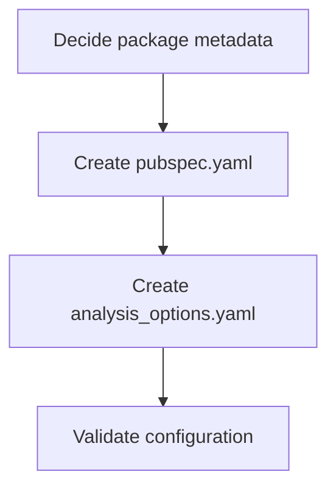

# task-0-1

## Identity

| Field          | Value                                                  |
|----------------|--------------------------------------------------------|
| Type           | Story                                                  |
| Title          | Set up package dependencies and analysis configuration |
| Parent Feature | task-0                                                 |
| Children Tasks | task-0-1-1, task-0-1-2                                 |

## Logical Flow

The package manifest and analysis configuration are created first so that every subsequent file added to the repository is validated against the chosen lint rules and can import the required packages.

## Objective

Produce a working `pubspec.yaml` and `analysis_options.yaml` that define the package identity, required dependencies, and static-analysis rules for the project.

## Scope Boundary

- Create `pubspec.yaml` with the dependency set required by the refined specification.
- Create `analysis_options.yaml` extending `package:lints/recommended.yaml`.
- Keep both files minimal and focused on Milestone 0 needs.

Out of scope (to be handled in child tasks):

- Generating code (`build_runner` will be invoked later when Freezed classes exist).
- Adding custom lint rules beyond the recommended set.
- Writing any Dart source files.

## Acceptance Criteria

- All children tasks are completed and accepted.
- `dart pub get` can be run successfully against `pubspec.yaml`.
- `dart analyze` can be run without configuration errors (even if there are no source files yet).
- Both files follow the project style and conventions.

## How

Use standard Dart package configuration. The `pubspec.yaml` should declare the package name, version, SDK constraint, and the exact dependency list from the refined specification. The `analysis_options.yaml` should extend `package:lints/recommended.yaml` and optionally include a small set of project-specific rules that will remain useful throughout development.

## Why

Dependency management and static analysis are the base layer of the project. Defining them up front ensures that later milestones can import `riverpod`, `freezed`, `meta`, and test packages, and that all contributors receive consistent analyzer feedback.
