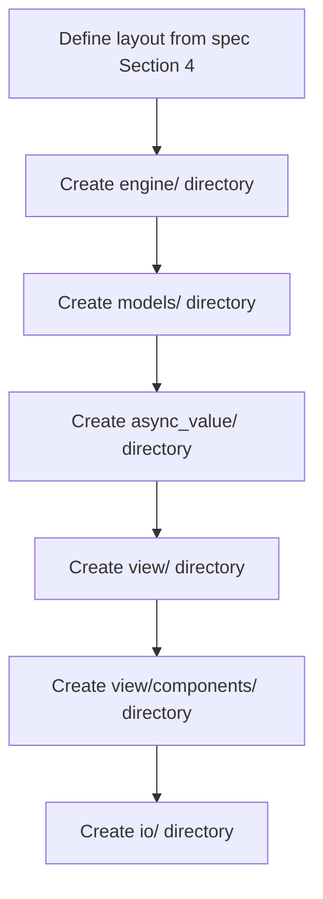

# task-0-2

## Identity

| Field          | Value                          |
|----------------|--------------------------------|
| Type           | Story                          |
| Title          | Create lib/src/ directory structure |
| Parent Feature | task-0                         |
| Children Tasks | task-0-2-1                     |

## Logical Flow

The source directory layout is created as a skeleton so that later milestones have a predictable place for engine, model, state-bridge, view, and I/O code.

## Objective

Create the `lib/src/` directory structure described in Section 4 of the refined specification, using `.gitkeep` placeholders to preserve empty folders in version control.

## Scope Boundary

- Create the following directories under `lib/src/`:
  - `engine/`
  - `models/`
  - `async_value/`
  - `view/`
  - `view/components/`
  - `io/`
- Use `.gitkeep` files where directories would otherwise be empty.

Out of scope (to be handled in later tasks):

- Creating any `.dart` implementation files inside the directories.
- Creating the public barrel file (handled in task-0-3).
- Adding exports or imports.

## Acceptance Criteria

- All children tasks are completed and accepted.
- The directory tree matches the layout defined in the refined specification.
- Empty directories are represented by `.gitkeep` files.
- `dart analyze` does not fail because of missing expected source folders.

## How

Create the directories with a single script or a series of `mkdir` commands, then add `.gitkeep` to each leaf directory. Do not add code stubs beyond a comment if required by the analyzer; the goal is to preserve the intended structure, not to implement anything.

## Why

The directory structure is the physical boundary between the public API (`lib/t22e.dart`) and internal implementation (`lib/src/`). Establishing it now makes the architecture visible and prevents ad-hoc file placement as the framework grows.
