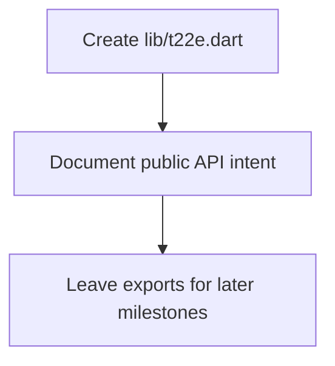

# task-0-3

## Identity

| Field          | Value                          |
|----------------|--------------------------------|
| Type           | Story                          |
| Title          | Create public barrel file      |
| Parent Feature | task-0                         |
| Children Tasks | task-0-3-1                     |

## Logical Flow

The public barrel file is the single entry point for framework users. It is created now so that the package boundary is explicit, even before any public symbols are exported.

## Objective

Create `lib/t22e.dart` as the unified public API export barrel for the `t22e` framework.

## Scope Boundary

- Create `lib/t22e.dart` at the package root.
- Include a package-level documentation comment explaining the intended public API.
- Do not export `src/` internals at this stage.

Out of scope (to be handled in later tasks):

- Exporting engine classes (these will be marked `@internal`).
- Exporting widgets and providers.
- Adding example usage to the barrel file.

## Acceptance Criteria

- All children tasks are completed and accepted.
- `lib/t22e.dart` exists and follows the barrel-file convention.
- The file compiles and passes static analysis.
- It does not prematurely expose internal implementation details.

## How

Create a single Dart file named `lib/t22e.dart`. Add a concise library doc comment describing the package's purpose and noting that users should import this file. Leave the export list empty or include only a minimal placeholder export if the analyzer requires a non-empty file.

## Why

A single public entry point simplifies consumption of the framework and hides internal structure. Establishing the barrel file early reinforces the public/private boundary defined by the `lib/src/` layout.
