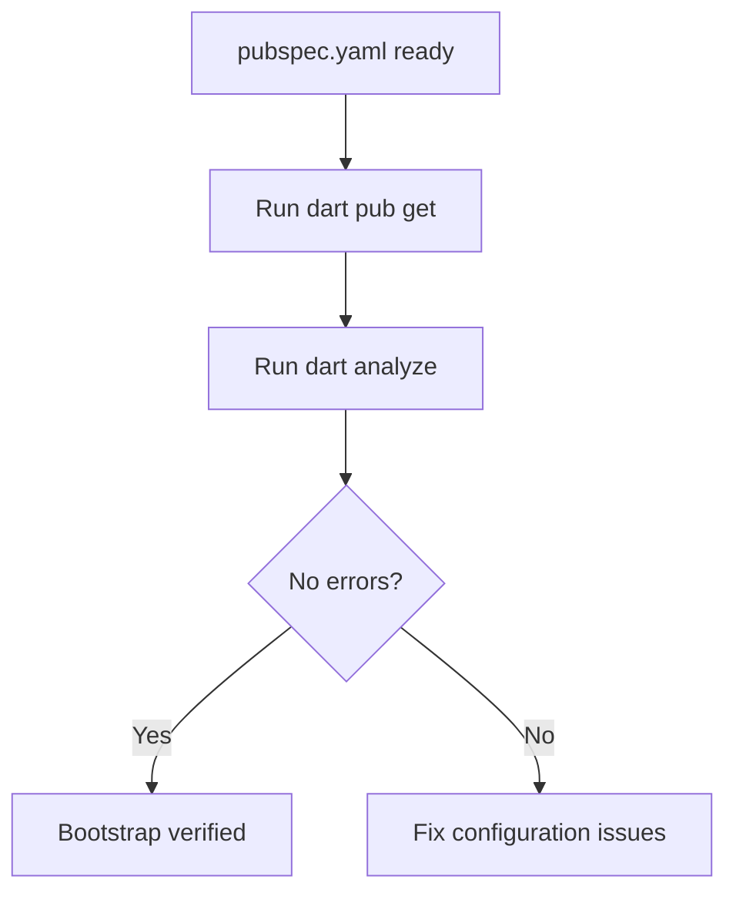

# task-0-4

## Identity

| Field          | Value                                       |
|----------------|---------------------------------------------|
| Type           | Story                                       |
| Title          | Verify bootstrap with static analysis       |
| Parent Feature | task-0                                      |
| Children Tasks | task-0-4-1                                  |

## Logical Flow

Once the package manifest, analysis configuration, source skeleton, and barrel file are in place, the bootstrap is validated by resolving dependencies and running the analyzer.

## Objective

Confirm that the Milestone 0 skeleton forms a valid, analyzable Dart package.

## Scope Boundary

- Run `dart pub get` to resolve dependencies.
- Run `dart analyze` to validate the empty package.
- Record any issues and fix them within the Milestone 0 scope.

Out of scope (to be handled in later tasks):

- Running unit tests (there is no testable code yet).
- Running `build_runner` (no generated code is needed yet).
- Adding continuous integration configuration.

## Acceptance Criteria

- All children tasks are completed and accepted.
- `dart pub get` completes without errors.
- `dart analyze` reports no errors.
- Any analyzer warnings are documented and accepted or resolved.

## How

Use the Dart CLI to resolve packages and analyze the project. If the analyzer reports errors caused by the skeleton (for example, an empty barrel file being treated incorrectly), fix them by adjusting the skeleton, not by adding implementation code. Document any intentional warnings.

## Why

Verification closes the milestone. It proves that the package is in a healthy state and that the tooling chain is ready for the implementation work in Milestone 1 and beyond.
