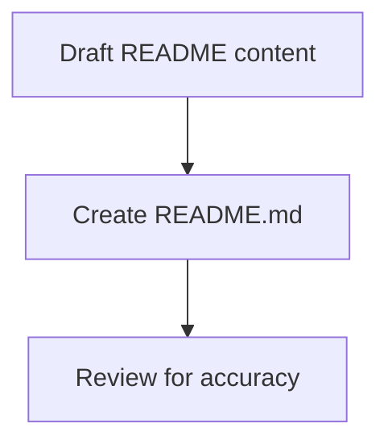

# task-0-5

## Identity

| Field          | Value                          |
|----------------|--------------------------------|
| Type           | Story                          |
| Title          | Add project README             |
| Parent Feature | task-0                         |
| Children Tasks | task-0-5-1                     |

## Logical Flow

A minimal README is added to document the project's purpose, build requirements, and current scope for anyone encountering the repository.

## Objective

Create a concise project `README.md` that explains what `t22e` is, how to get started, and the current milestone scope.

## Scope Boundary

- Create `README.md` at the repository root.
- Include project description, Dart SDK requirement, and basic commands.
- Mention that the project is in early bootstrap and that public API is not yet available.

Out of scope (to be handled in later tasks):

- Full API documentation.
- Usage examples (widgets and providers do not exist yet).
- Badges, screenshots, or advanced formatting.

## Acceptance Criteria

- All children tasks are completed and accepted.
- `README.md` exists and accurately describes the project.
- The file is free of broken links or incorrect commands.
- The README reflects the Milestone 0 scope boundary.

## How

Write a short README with standard sections: title, one-paragraph description, prerequisites, getting-started commands, and a note about the current milestone. Keep it honest about the early state of the framework and avoid promising features that are not yet implemented.

## Why

A README is the first point of contact for contributors and users. Providing a minimal but accurate one during bootstrap sets expectations and makes the repository self-describing.
