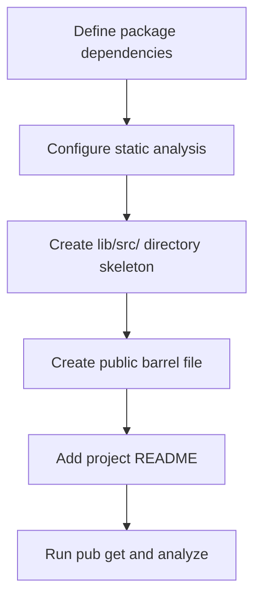

# task-0

## Identity

| Field            | Value                                                  |
|------------------|--------------------------------------------------------|
| Type             | Feature                                                |
| Title            | Milestone 0 — Project Bootstrap                        |
| Children Stories | task-0-1, task-0-2, task-0-3, task-0-4, task-0-5       |

## Logical Flow

This milestone creates the foundational repository structure and tooling configuration required by every later milestone. No framework logic is implemented here; the goal is a valid, analyzable Dart package ready to receive engine, state, and widget code.

## Objective

Establish the repository skeleton for the `t22e` pure-Dart TUI framework so that subsequent milestones can add implementation code with a working build and analysis pipeline.

## Scope Boundary

- Create a valid `pubspec.yaml` with the required dependencies.
- Create an `analysis_options.yaml` based on `package:lints/recommended.yaml`.
- Create the `lib/src/` directory structure defined in Section 4 of the refined specification, using `.gitkeep` placeholders.
- Create the public barrel file `lib/t22e.dart`.
- Add a minimal project `README.md`.
- Verify the skeleton by running `dart pub get` and `dart analyze`.

Out of scope (to be handled in later milestones):

- Widget implementations.
- Engine logic (cell buffer, diff engine, ANSI writer, etc.).
- State bridge and Riverpod integration.
- Example applications or integration tests.
- `CHANGELOG.md`.

## Acceptance Criteria

- All children stories are completed and accepted.
- `dart pub get` resolves dependencies successfully.
- `dart analyze` reports no errors on the empty skeleton.
- The public barrel file and `lib/src/` layout match the refined specification.

## How

Follow the three-level task template for this feature and its child stories. Each story focuses on one bootstrap concern and delegates concrete, single-session work to simple tasks. Use `.gitkeep` for empty directories so the intended package layout is preserved in version control without introducing implementation code.

## Why

A clean, validated package skeleton is a prerequisite for the iterative delivery of the framework. Establishing dependency management, analysis rules, and the public/private source boundary early prevents structural churn once engine and widget code are introduced.
