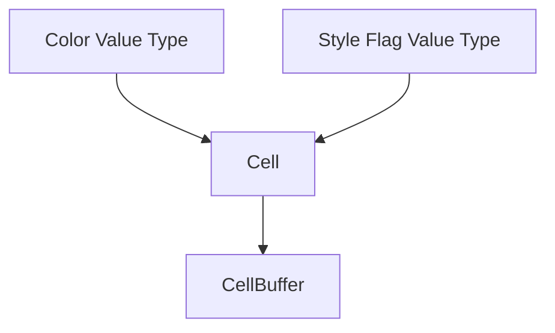

# task-1-1

## Identity

| Field          | Value                       |
|----------------|-----------------------------|
| Type           | Story                       |
| Title          | Define Immutable Cell Type  |
| Parent Feature | task-1                      |
| Children Tasks | task-1-1-1, task-1-1-2      |

## Logical Flow

The terminal cell is the smallest unit of output. It combines a visible character with visual attributes. This story defines the value types that describe those attributes and wraps them in an immutable `Cell` record.

## Objective

Create the immutable `Cell` type and the small value types it depends on: a color type supporting ANSI 16, ANSI 256, and RGB variants, plus a style flag type covering bold, italic, underline, and inverse.

## Scope Boundary

- Deliverable this story introduces:
  - A color value type with ANSI 16, ANSI 256, and RGB variants.
  - A style flag value type.
  - A Freezed `Cell` record containing character, optional foreground, optional background, and style flags.

Out of scope (to be handled in child tasks):

- Integration with `CellBuffer`.
- ANSI sequence generation.
- Default/blank cell semantics beyond a non-null default space.

## Acceptance Criteria

- All children tasks are completed and accepted.
- `Cell` is const-creatable and supports equality, hash-based equality, and `copyWith`.
- Unit tests verify equality, `copyWith`, and default style values.

## How

Represent color as a sealed/union type or a small class hierarchy that mirrors the ANSI encoding paths found in `packages/ansi/lib/src/color.dart`: ANSI 16 index, ANSI 256 index, and RGB triple. Represent style flags as a Freezed object or bit-field wrapper. Compose both into a single Freezed `Cell` in `lib/src/engine/cell.dart`.

## Why

`Cell` is the atomic output unit of the framework. Every frame will allocate and compare large numbers of cells, so immutability and value semantics are critical for the diff engine to operate correctly.
