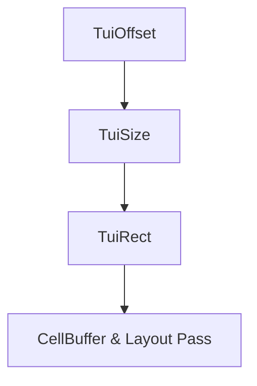

# task-1-2

## Identity

| Field          | Value                        |
|----------------|------------------------------|
| Type           | Story                        |
| Title          | Define Geometry Primitives   |
| Parent Feature | task-1                       |
| Children Tasks | task-1-2-1, task-1-2-2, task-1-2-3 |

## Logical Flow

The layout and paint passes need integer terminal-cell geometry. This story defines the primitive geometric types used throughout the engine and widget layer.

## Objective

Provide immutable, integer-based geometry primitives: `TuiOffset` for positions, `TuiSize` for dimensions, and `TuiRect` for axis-aligned rectangles in terminal-cell coordinates.

## Scope Boundary

- Deliverable this story introduces:
  - `TuiOffset` with `dx` and `dy` integer components.
  - `TuiSize` with `width` and `height` integer components.
  - `TuiRect` combining an offset and size with convenience accessors and containment/intersection helpers.

Out of scope (to be handled in child tasks and later milestones):

- Layout algorithm or constraint solving.
- Fractional sizes or sub-cell positioning.
- Painting or clipping logic.

## Acceptance Criteria

- All children tasks are completed and accepted.
- All three types are Freezed-generated, const-creatable, and equality-comparable.
- `TuiRect` helpers (`left`, `right`, `top`, `bottom`, `contains`, `intersect`) are unit tested.

## How

Place all geometry types in `lib/src/models/geometry.dart`. Keep them as lightweight Freezed classes with no terminal-specific behavior beyond integer coordinates. Add small arithmetic helpers (e.g., `TuiOffset + TuiOffset`, `TuiSize.constrain`) as extensions or class methods.

## Why

Geometry primitives appear in buffer addressing, layout contracts, and widget positioning. Defining them as immutable, well-tested value types gives the rest of the framework a consistent coordinate model.
