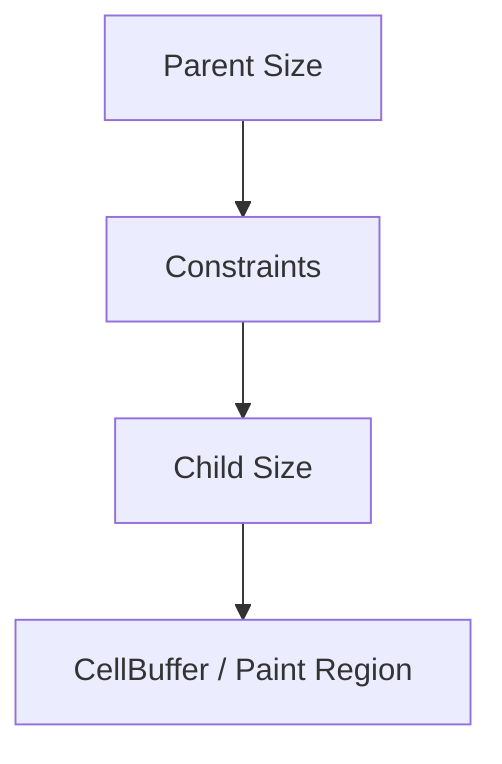

# task-1-3

## Identity

| Field          | Value           |
|----------------|-----------------|
| Type           | Story           |
| Title          | Define Constraints |
| Parent Feature | task-1          |
| Children Tasks | task-1-3-1        |

## Logical Flow

The simplified layout pass passes available space from parent to child. `Constraints` is the object that carries that available space: minimum and maximum width and height in terminal cells.

## Objective

Create an immutable `Constraints` type with integer min/max width and height, plus convenience factories and helper methods.

## Scope Boundary

- Deliverable this story introduces:
  - Freezed `Constraints` with `minWidth`, `maxWidth`, `minHeight`, `maxHeight`.
  - Factories `Constraints.tight(TuiSize)` and `Constraints.loose(TuiSize)`.
  - A `constrain(TuiSize)` helper that clamps a size to the constraint box.

Out of scope (to be handled in later milestones):

- The actual layout algorithm.
- Widget constraint propagation.
- Multi-child layout (Flex, Row, etc.).

## Acceptance Criteria

- All children tasks are completed and accepted.
- `Constraints` is Freezed-generated, const-creatable, and equality-comparable.
- `tight`, `loose`, and `constrain` behaviors are unit tested.

## How

Implement `Constraints` in `lib/src/models/constraints.dart` as a Freezed class with integer min/max fields. Provide named factories for the common tight and loose constraint patterns. Add `constrain` as a pure function returning a new `TuiSize`.

## Why

Even the simplified layout pass needs a contract for passing size limits down the tree. `Constraints` is that contract, and defining it now prevents ad-hoc width/height tuples from appearing across the codebase.
