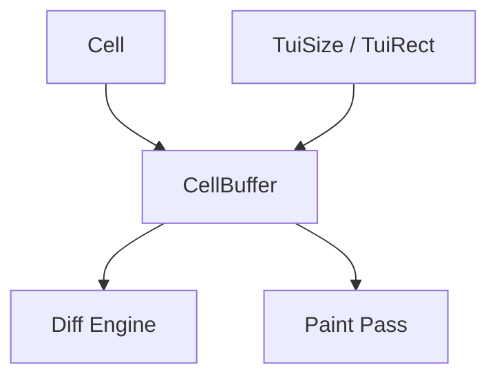

# task-1-4

## Identity

| Field          | Value                        |
|----------------|------------------------------|
| Type           | Story                        |
| Title          | Implement Flat Cell Buffer   |
| Parent Feature | task-1                       |
| Children Tasks | task-1-4-1, task-1-4-2       |

## Logical Flow

The engine renders frames into a target buffer and compares it against the current display state. This story creates the flat 1D buffer that holds immutable `Cell` values and supports coordinate addressing and value-copy semantics.

## Objective

Implement a `CellBuffer` that stores immutable cells in a flat `List<Cell>`, exposes 2D coordinate helpers, and supports value-copy semantics for double buffering.

## Scope Boundary

- Deliverable this story introduces:
  - Flat 1D `CellBuffer` backed by a pre-allocated `List<Cell>`.
  - Read/write helpers by (x, y) and by index.
  - Value-copy semantics for copying one buffer into another.
  - Resize support that preserves overlapping content.

Out of scope (to be handled in later milestones):

- Diff engine or ANSI output.
- Paint pass or widget tree integration.
- Mutable cell optimization.

## Acceptance Criteria

- All children tasks are completed and accepted.
- `CellBuffer` can be created with a width, height, and default cell.
- Coordinate helpers correctly map (x, y) to flat index and back.
- Value-copy from a source buffer does not share mutable state with the destination.
- Resize preserves cells in the overlapping region and fills new cells with the default.

## How

Implement `CellBuffer` in `lib/src/engine/cell_buffer.dart` as a class wrapping a `List<Cell>`. Pre-allocate the list to `width * height`. Because `Cell` is immutable, a value copy is a shallow list copy of references, which is safe and cheap. Provide explicit `copyFrom`, `get`, `set`, and helper accessors.

## Why

The buffer is where the engine materializes each frame. A flat, pre-allocated, value-copyable buffer keeps the paint and diff passes simple and predictable, and matches the architecture described in Section 7 of the refined specification.
