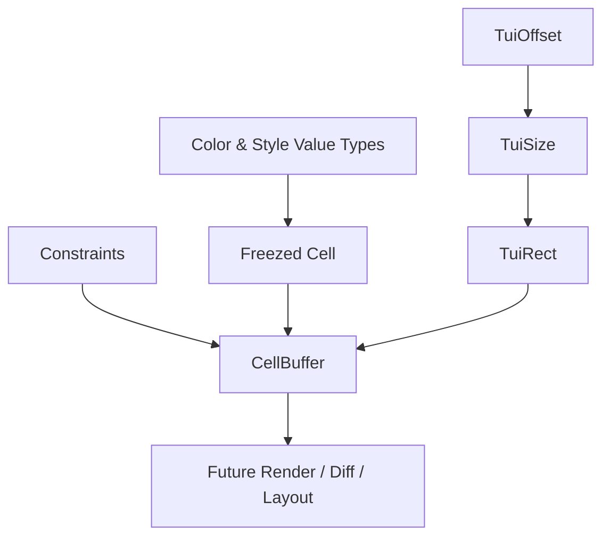

# task-1

## Identity

| Field            | Value                                                              |
|------------------|--------------------------------------------------------------------|
| Type             | Feature                                                            |
| Title            | Immutable Core Primitives                                          |
| Children Stories | task-1-1, task-1-2, task-1-3, task-1-4                             |

## Logical Flow

This feature establishes the immutable value layer that the rendering engine and declarative view layer share. It is a pure data layer with no business logic, I/O, or rendering concerns.

## Objective

Define the immutable core primitives required by every downstream milestone:
- A `Cell` type representing one terminal cell with character, foreground, background, and style flags.
- Geometry primitives (`TuiOffset`, `TuiSize`, `TuiRect`) for integer terminal coordinates.
- A `Constraints` type for the simplified layout pass.
- A flat 1D `CellBuffer` with value-copy semantics and coordinate helpers.

## Scope Boundary

- Freezed-based immutable value types.
- Color representation covering ANSI 16, ANSI 256, and RGB (inspired by `packages/ansi/lib/src/color.dart`).
- Geometry and constraint types with integer terminal-cell semantics.
- Flat `CellBuffer` abstraction with read/write helpers and value-copy semantics.

Out of scope (to be handled in child stories and later milestones):

- ANSI sequence generation or terminal output.
- Diff engine or frame scheduling.
- Widget tree, build pass, layout pass, or paint pass.
- Riverpod integration, state bridge, or stdin handling.

## Acceptance Criteria

- All children stories are completed and accepted.
- Every Freezed type has generated files and passes static analysis.
- `CellBuffer` value-copy semantics are verified by unit tests.
- All new code is covered by unit tests where behavior is non-trivial.

## How

Use `freezed` and `freezed_annotation` to model `Cell`, geometry types, and `Constraints`. Define small, const-friendly color/style value types first, then compose them into `Cell`. Build the flat buffer as a thin wrapper around a pre-allocated `List<Cell>` with explicit value-copy semantics rather than relying on reference sharing.

## Why

These primitives are the shared vocabulary of the engine and widget layers. Getting their immutability, equality, and copy semantics correct early prevents subtle rendering and state bugs once the framework begins assembling widget trees and diffing frames.
