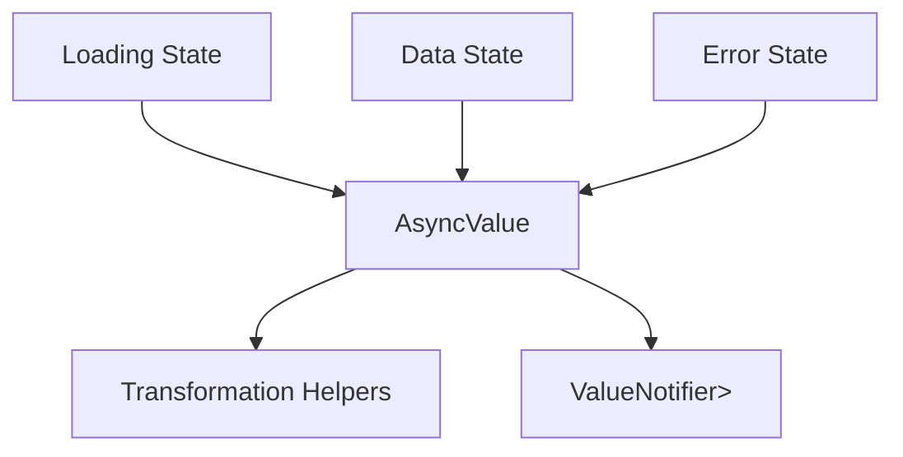

# task-2-1

## Identity

| Field          | Value                       |
|----------------|-----------------------------|
| Type           | Story                       |
| Title          | Local AsyncValue Clone      |
| Parent Feature | task-2                      |
| Children Tasks | task-2-1-1, task-2-1-2      |

## Logical Flow

The bridge needs a common representation for the lifecycle of an asynchronous value: loading while waiting, data on success, and error on failure. This story defines a local clone of Riverpod's `AsyncValue<T>` so the framework can depend on a small, controlled surface rather than re-exporting Riverpod internals.

## Objective

Create a local `AsyncValue<T>` type with three states (`data`, `loading`, `error`) and a practical set of transformation helpers (`when`, `maybeWhen`, `map`, etc.) that the rest of the framework can rely on.

## Scope Boundary

- Deliverable this story introduces:
  - A sealed `AsyncValue<T>` class with `AsyncData`, `AsyncLoading`, and `AsyncError` variants.
  - Value equality and `hashCode` support across all variants.
  - Synchronous transformation helpers (`when`, `maybeWhen`, `map`, `maybeMap`).

Out of scope (to be handled in child tasks):

- The `StreamValueNotifier<T>` bridge itself.
- Riverpod provider integration.
- Async/stack-trace preserving helpers beyond the basic API.

## Acceptance Criteria

- All children tasks are completed and accepted.
- `AsyncValue<T>` is equality-comparable and const-friendly where possible.
- Helpers cover the common read patterns needed by ViewModels and widgets.
- Unit tests verify construction, equality, and helper behavior.

## How

Implement `AsyncValue<T>` as a sealed class hierarchy without code generation to keep dependencies minimal. Add named constructors/factories for `data`, `loading`, and `error`. Implement `when`/`maybeWhen` and `map`/`maybeMap` methods that mirror Riverpod's API closely enough to be familiar, but only include the methods the framework actually needs.

## Why

`AsyncValue<T>` is the shared currency of the state bridge. Defining it locally avoids leaking Riverpod implementation details into the engine and gives the project full control over behavior, equality, and the public surface.
