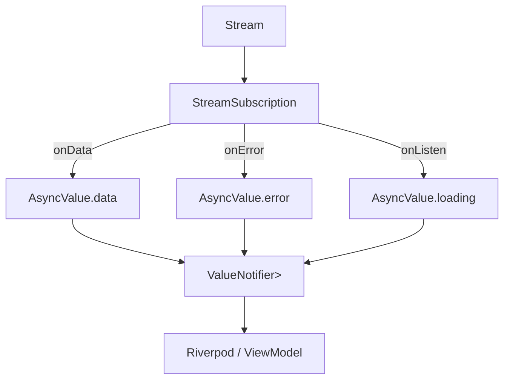

# task-2-2

## Identity

| Field          | Value                       |
|----------------|-----------------------------|
| Type           | Story                       |
| Title          | Stream Value Notifier Bridge |
| Parent Feature | task-2                      |
| Children Tasks | task-2-2-1, task-2-2-2      |

## Logical Flow

A `Stream<T>` of events must be converted into a synchronously observable `ValueNotifier<AsyncValue<T>>`. This story implements the bridge object that owns the stream subscription, updates the notifier immediately when an event arrives, and cleans up on disposal.

## Objective

Implement `StreamValueNotifier<T>`: an object that listens to a `Stream<T>` and exposes the stream's state through a `ValueNotifier<AsyncValue<T>>`.

## Scope Boundary

- Deliverable this story introduces:
  - `StreamValueNotifier<T>` wrapping a `ValueNotifier<AsyncValue<T>>`.
  - Automatic transition to `AsyncLoading` when listening starts.
  - `AsyncData<T>` updates on each stream event.
  - `AsyncError<T>` updates on stream errors.
  - Disposable lifecycle management (cancel subscription, remove listeners).

Out of scope (to be handled in child tasks):

- Riverpod provider integration.
- ANSI parser or stdin integration.
- Refresh/re-subscription strategies.

## Acceptance Criteria

- All children tasks are completed and accepted.
- The notifier immediately reflects loading, data, and error states as the stream emits.
- Stream errors are captured and propagated as `AsyncError`.
- Disposing the bridge cancels the subscription and releases listeners.
- Unit tests verify the full lifecycle with a controlled stream.

## How

Create a small controller class that holds a `ValueNotifier<AsyncValue<T>>` and a `StreamSubscription<T>`. Initialize the notifier to `AsyncLoading` in the constructor, listen to the stream, and update the notifier value synchronously inside the listener callbacks. Expose the notifier via a getter and provide a `dispose()` method that cancels the subscription and disposes the notifier.

## Why

This bridge is the critical piece that makes the async input path feel synchronous to the MVVM layer. By updating a `ValueNotifier` directly from the stream listener, Riverpod-based ViewModels are notified on the same event-loop turn and can update application state without extra async hops.
