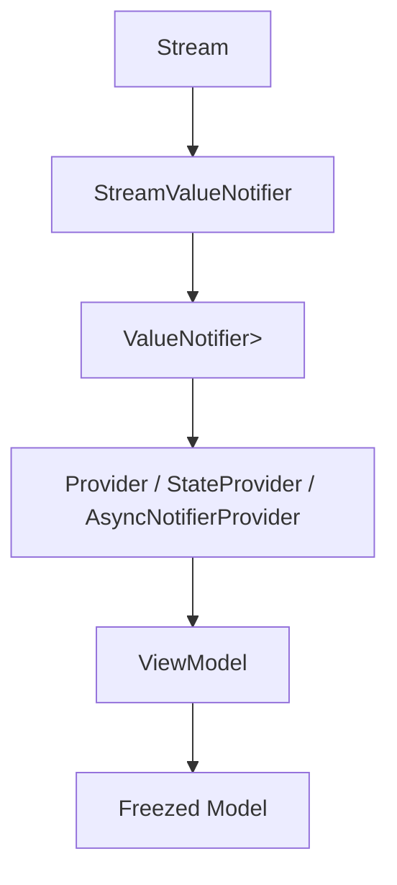

# task-2-3

## Identity

| Field          | Value                       |
|----------------|-----------------------------|
| Type           | Story                       |
| Title          | Riverpod Provider Integration |
| Parent Feature | task-2                      |
| Children Tasks | task-2-3-1, task-2-3-2      |

## Logical Flow

The `StreamValueNotifier<T>` bridge is most useful when consumed as a Riverpod provider. This story exposes the bridge through providers so ViewModels can watch the same synchronous state updates without importing internal bridge classes.

## Objective

Integrate the state bridge with Riverpod so that a stream-backed `AsyncValue<T>` can be observed through standard Riverpod providers.

## Scope Boundary

- Deliverable this story introduces:
  - A factory/provider helper that creates a `StreamValueNotifier<T>` from a `Stream<T>`.
  - Provider patterns that expose `AsyncValue<T>` to ViewModels (e.g., `StateProvider`, `Provider<ValueNotifier<AsyncValue<T>>>`, or a custom `AsyncNotifier`).
  - Clean disposal when the provider is no longer watched.
  - Barrel exports for the public bridge API.

Out of scope (to be handled in child tasks):

- Direct stdin wiring or ANSI parsing.
- Widget-level consumer bindings.
- Complex provider families or scoped overrides.

## Acceptance Criteria

- All children tasks are completed and accepted.
- A ViewModel can watch a provider-backed `AsyncValue<T>` derived from a stream.
- Provider disposal correctly cleans up the underlying `StreamValueNotifier`.
- Public exports hide internal `src/` paths from typical users.
- Unit tests verify provider integration with a controlled stream.

## How

Introduce a small provider helper or extension in `lib/src/async_value/` that builds a `StreamValueNotifier<T>` and exposes either the `ValueNotifier` or the current `AsyncValue`. Use Riverpod's `Provider`/`StateProvider` lifecycle to call `dispose()` when the provider is destroyed. Re-export the public types through `lib/t22e.dart` while keeping implementation files under `src/`.

## Why

Riverpod is the framework's chosen state-management solution. Without provider integration, every ViewModel would need to manually manage the bridge subscription. Wrapping the bridge in providers makes the public API idiomatic and reduces boilerplate for framework users.
