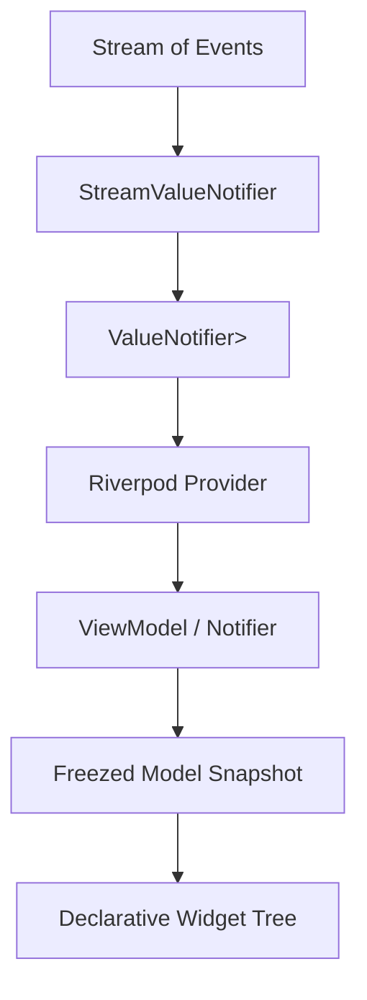

# task-2

## Identity

| Field            | Value                                                              |
|------------------|--------------------------------------------------------------------|
| Type             | Feature                                                            |
| Title            | Synchronous State Bridge                                           |
| Children Stories | task-2-1, task-2-2, task-2-3                                       |

## Logical Flow

This feature builds the bridge between asynchronous terminal input and the synchronous MVVM state layer. A `Stream<T>` of parsed or synthetic events is converted into a `ValueNotifier<AsyncValue<T>>`, which Riverpod ViewModels observe to update immutable models on the same event-loop turn.

## Objective

Implement the stream-to-state bridge that feeds the MVVM layer:
- A local `AsyncValue<T>` clone with `data`, `loading`, and `error` states.
- A `StreamValueNotifier<T>` that listens to a `Stream<T>` and exposes a `ValueNotifier<AsyncValue<T>>`.
- Riverpod provider integration so ViewModels can observe the bridge as a provider.

## Scope Boundary

- Local `AsyncValue<T>` clone (`data`, `loading`, `error`) with transformation helpers.
- `StreamValueNotifier<T>` with lifecycle management and error propagation.
- Riverpod provider wrappers and barrel exports.
- Unit tests verifying the bridge semantics.

Out of scope (to be handled in child stories and later milestones):

- ANSI parser and actual terminal input handling.
- Rendering engine, layout, or paint passes.
- Widget tree or declarative components.
- Raw mode, stdin byte reading, or stdout flushing.

## Acceptance Criteria

- All children stories are completed and accepted.
- `AsyncValue<T>` supports data/loading/error states and common transformation helpers.
- `StreamValueNotifier<T>` correctly propagates stream events into `AsyncValue<T>` updates.
- Riverpod provider integration is usable by ViewModels without importing `src/` internals.
- All new code is covered by unit tests where behavior is non-trivial.

## How

Define a lightweight, non-generated `AsyncValue<T>` sealed class with value equality and `when`/`map` helpers. Build `StreamValueNotifier<T>` on top of `ValueNotifier<AsyncValue<T>>` with a managed `StreamSubscription` that transitions through loading, data, and error states. Expose the bridge through Riverpod providers (`StateProvider`, `StreamProvider`-like wrappers, or `Provider` of `ValueNotifier`) so downstream ViewModels observe the same synchronous update path.

## Why

The framework needs terminal input events to reach ViewModels as quickly and predictably as possible. By making the stream listener update a `ValueNotifier` synchronously within the same event-loop turn, Riverpod-based ViewModels can react immediately and emit new immutable models without waiting for an extra async boundary.
