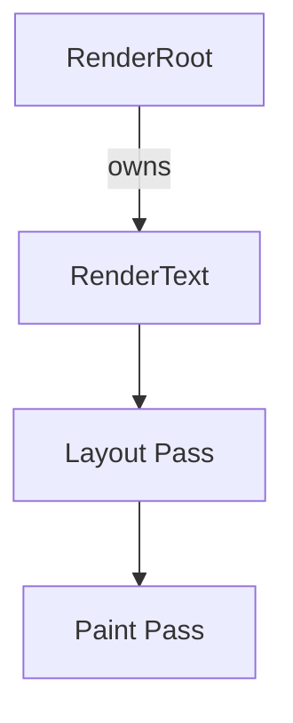

# task-3-1

## Identity

| Field          | Value                       |
|----------------|-----------------------------|
| Type           | Story                       |
| Title          | Render Tree Abstractions    |
| Parent Feature | task-3                      |
| Children Tasks | task-3-1-1                  |

## Logical Flow

The render tree is the long-lived, mutable layer that knows how to measure and draw terminal cells. This story introduces the `RenderObject` abstraction and the concrete render objects needed for the first full-screen text deliverable: a leaf that renders a string and a root that sizes its child to the terminal.

## Objective

Create the render tree abstractions needed by the rendering pipeline:
- Define the base `RenderObject` class.
- Define `RenderText`, a leaf render object that renders a string.
- Define `RenderRoot`, a single-child render object that fills the terminal and positions its child.
- Establish the single-child render object protocol.

## Scope Boundary

- Deliverable this story introduces:
  - Base `RenderObject` class with size, offset, and lifecycle hooks.
  - `SingleChildRenderObject` mixin/base for one-child render objects.
  - `RenderText` carrying string content and style.
  - `RenderRoot` that sizes its child to the terminal bounds and paints it at `(0, 0)`.
  - Parent-data protocol for offsets and slots.

Out of scope (to be handled in child tasks):

- Layout and paint algorithms.
- Diff engine or ANSI output.
- Widget/Element/BuildContext abstractions (Milestone 5).
- Multi-child render objects.

## Acceptance Criteria

- All children tasks are completed and accepted.
- `RenderObject` exposes size, offset, parent, and child accessors.
- `RenderText` is a leaf render object.
- `RenderRoot` is a single-child render object that owns a child.
- The render tree can be constructed and traversed manually.
- Unit tests verify render tree construction and parent/child relationships.

## How

Model `RenderObject` as a mutable base class with `Size size`, `Offset offset`, and `RenderObject? parent`. Introduce a `SingleChildRenderObject` helper for nodes with exactly one child, managing `child` assignment and parent-data updates. `RenderText` stores the string and style and has no children. `RenderRoot` stores a single child and will later layout that child to match the terminal size and paint it at the origin. Keep the API aligned with Flutter's `RenderObject` surface so the future Widget/Element layer can attach to it without changes.

## Why

The render tree is the stable, long-lived counterpart to the short-lived widget tree that will be introduced later. Defining it first lets the pipeline operate on real layout/paint objects while the widget layer is still being designed.
