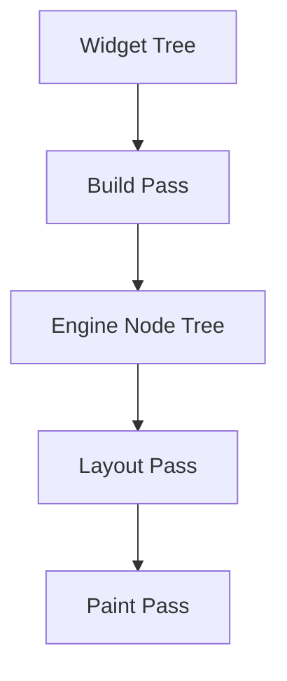

# task-3-1

## Identity

| Field          | Value                       |
|----------------|-----------------------------|
| Type           | Story                       |
| Title          | Build Pass and Engine Nodes |
| Parent Feature | task-3                      |
| Children Tasks | task-3-1-1                  |

## Logical Flow

Declarative widgets describe what the UI should look like, but the engine needs a runtime representation it can layout and paint. This story introduces the widget-to-node build pass, which compiles a tree of immutable widgets into a tree of immutable engine nodes.

## Objective

Create the build pass that compiles widget trees into engine nodes:
- Define the base `Widget` and `Node` abstractions.
- Implement a `Text` widget that compiles to a `TextNode`.
- Provide access to the `TuiContext` provider container during the build pass.

## Scope Boundary

- Deliverable this story introduces:
  - Base `Widget` class with a `build` or `compile` contract.
  - Base `Node` class representing the runtime engine node.
  - `TextNode` carrying string content and style flags.
  - `TuiContext` bridge so nodes can read Riverpod providers.

Out of scope (to be handled in child tasks):

- Layout, paint, diff, or ANSI output logic.
- Multi-child widgets such as Row, Column, or Flex.
- Real stdin input or provider state changes.

## Acceptance Criteria

- All children tasks are completed and accepted.
- A widget tree can be compiled into a corresponding node tree.
- `Text` widget produces a `TextNode` with the correct content and style.
- The build pass can read model snapshots through `TuiContext`.
- Unit tests verify widget-to-node compilation.

## How

Create immutable base classes for `Widget` and `Node`. A widget exposes a method that, given a `TuiContext`, returns a `Node`. The engine pipeline invokes this recursively to produce the runtime tree. Keep the abstraction minimal: nodes are data-only runtime blueprints that later passes will layout and paint.

## Why

Separating the declarative widget layer from the runtime node layer keeps widgets cheap to reconstruct on every state change while giving the engine a stable, purpose-built structure to operate on during layout and paint.
