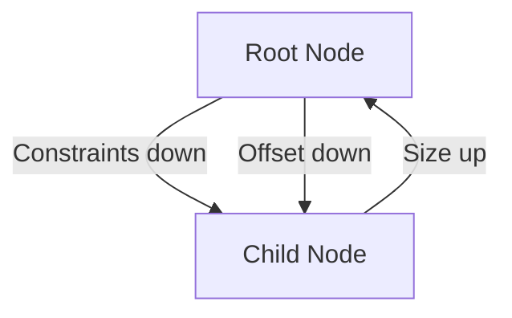

# task-3-2

## Identity

| Field          | Value                       |
|----------------|-----------------------------|
| Type           | Story                       |
| Title          | Simplified Layout Pass      |
| Parent Feature | task-3                      |
| Children Tasks | task-3-2-1                  |

## Logical Flow

Before painting, the engine must know the size and position of each node. This story implements a simplified layout pass where the root node receives the full terminal size and each node reports its exact integer-cell size back to its parent.

## Objective

Implement the simplified layout pass:
- Pass available terminal dimensions from the root downward.
- Let each node compute and report its exact size upward.
- Assign integer-cell offsets to each node.

## Scope Boundary

- Deliverable this story introduces:
  - Layout method on `Node` that accepts `Constraints` and returns `TuiSize`.
  - Integer-only width and height calculations.
  - Root layout seeded with terminal dimensions.
  - `TextNode` layout that measures string dimensions.

Out of scope (to be handled in child tasks):

- Multi-child layout and positioning.
- Fractional sizes or constraint negotiation.
- Scrollable or overflow behavior.

## Acceptance Criteria

- All children tasks are completed and accepted.
- The layout pass computes sizes for every node in the tree.
- All dimensions are integer terminal cells.
- `TextNode` reports a size matching its content within given constraints.
- Unit tests verify layout results for single and nested nodes.

## How

Implement a `TuiSize layout(Constraints constraints)` method on `Node`. The pipeline calls this on the root node with constraints equal to the terminal size. For this milestone, `TextNode` measures its string content and returns a size bounded by the constraints. Offsets can be computed top-down after sizes are known, or embedded during the same recursive pass.

## Why

Layout determines where each node will paint. Keeping the first pass simple avoids premature investment in a full constraint engine while still providing the geometry needed by the paint pass.
