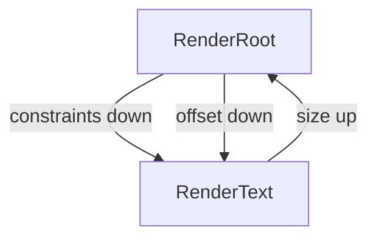

# task-3-2

## Identity

| Field          | Value                       |
|----------------|-----------------------------|
| Type           | Story                       |
| Title          | Two-Pass Constraint Layout  |
| Parent Feature | task-3                      |
| Children Tasks | task-3-2-1                  |

## Logical Flow

Before painting, the engine must know the size and position of each render object. This story implements the Flutter-style two-pass layout protocol on the render tree: parents pass constraints down, children measure themselves and report sizes up, then parents assign offsets.

## Objective

Implement the two-pass constraint layout pass:
- Pass available terminal dimensions from the root downward.
- Let each render object compute and report its exact size upward.
- Assign integer-cell offsets to each render object.

## Scope Boundary

- Deliverable this story introduces:
  - `RenderObject.layout(Constraints constraints)` entry point.
  - `RenderObject.performLayout(Constraints constraints)` subclass contract.
  - Two-pass protocol on `RenderRoot` and `RenderText`.
  - Integer-only width and height calculations.
  - Root layout seeded with terminal dimensions.

Out of scope (to be handled in child tasks):

- Multi-child layout and positioning.
- Flex, Row, Column, or alignment widgets.
- Fractional sizes or complex constraint negotiation.
- Scrollable or overflow behavior beyond clipping.

## Acceptance Criteria

- All children tasks are completed and accepted.
- The layout pass computes sizes for every render object in the tree.
- All dimensions are integer terminal cells.
- `RenderText` reports a size matching its content within given constraints.
- `RenderRoot` sizes its child to the terminal bounds and assigns offset `(0, 0)`.
- Unit tests verify layout results for single and nested render objects.

## How

Implement `layout(Constraints)` on `RenderObject` as the public entry point that delegates to `performLayout(Constraints)`. Subclasses set `this.size` during `performLayout`. `RenderText` splits its string on newlines, computes width as the longest line and height as the line count, and clamps both by the constraints. `RenderRoot` receives tight terminal constraints, calls `child.layout(constraints)`, and sets `child.offset` to `(0, 0)`. The pipeline starts the pass by calling `root.layout(Constraints.tight(terminalSize))`.

## Why

Layout determines where each render object will paint. Adopting Flutter's two-pass constraint protocol from the start ensures the API can grow into real layout widgets later without a breaking redesign.
