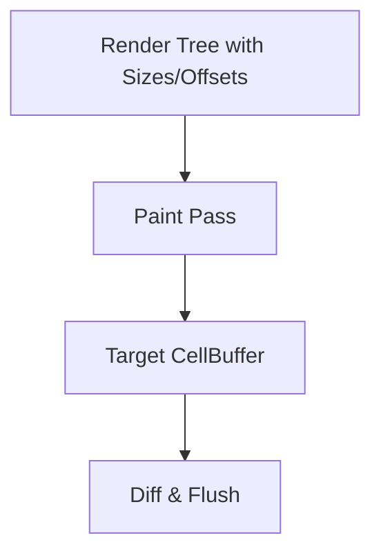

# task-3-3

## Identity

| Field          | Value                            |
|----------------|----------------------------------|
| Type           | Story                            |
| Title          | RenderObject Paint Pass          |
| Parent Feature | task-3                           |
| Children Tasks | task-3-3-1                       |

## Logical Flow

Once sizes and offsets are known, the engine can paint the desired frame into a target buffer. This story implements the paint pass, where each render object writes immutable `Cell` values into the target `CellBuffer` at its assigned offset.

## Objective

Implement the paint pass:
- Add a `paint` method to render objects.
- Write immutable `Cell` values into the target `CellBuffer`.
- Handle clipping to the render object's bounds.

## Scope Boundary

- Deliverable this story introduces:
  - `paint(CellBuffer buffer, Offset offset)` contract on `RenderObject`.
  - `RenderText` paint implementation that writes characters with styles.
  - `RenderRoot` paint implementation that delegates to its child at the child's offset.
  - Bounds checking/clipping against the render object size.

Out of scope (to be handled in child tasks):

- Diff engine and ANSI output.
- Multi-child composition and z-ordering.
- Scrollable or virtualized content.

## Acceptance Criteria

- All children tasks are completed and accepted.
- The paint pass fills the target `CellBuffer` with `Cell` values.
- `RenderText` writes its content at the correct offset and style.
- `RenderRoot` paints its child at the child's assigned offset.
- Painting does not write outside the render object bounds.
- Unit tests verify paint results for single and nested render objects.

## How

Implement `void paint(CellBuffer buffer, Offset offset)` on `RenderObject`. The pipeline creates a fresh target `CellBuffer` of terminal size, then calls `root.paint(target, Offset.zero)`. `RenderText` iterates over its content lines and writes one `Cell` per character, using the render object's style for foreground, background, and flags, skipping characters that fall outside its computed size. `RenderRoot` calls `child.paint(target, offset + child.offset)`. Because cells are immutable, every write is a value write into the flat buffer.

## Why

The paint pass produces the target canvas that represents the desired frame. Keeping cells immutable and writing them into a pre-allocated flat buffer keeps the implementation deterministic and easy to test.
