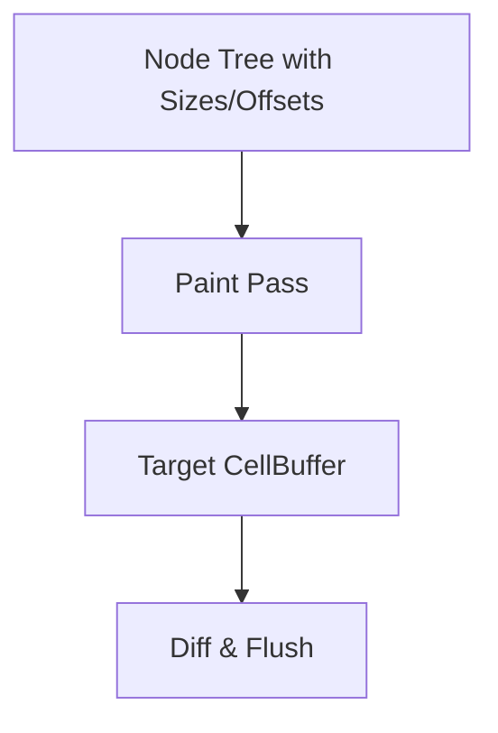

# task-3-3

## Identity

| Field          | Value                            |
|----------------|----------------------------------|
| Type           | Story                            |
| Title          | Paint Pass and CellBuffer Rendering |
| Parent Feature | task-3                           |
| Children Tasks | task-3-3-1                       |

## Logical Flow

Once sizes and offsets are known, the engine can paint the desired frame into a target buffer. This story implements the paint pass, where each node writes immutable `Cell` values into the target `CellBuffer`.

## Objective

Implement the paint pass:
- Add a `paint` method to engine nodes.
- Write immutable `Cell` values into the target `CellBuffer`.
- Handle clipping to the node's bounds.

## Scope Boundary

- Deliverable this story introduces:
  - `paint` method on `Node` that receives a `CellBuffer` and an offset.
  - `TextNode` paint implementation that writes characters with styles.
  - Bounds checking/clipping against the node size.

Out of scope (to be handled in child tasks):

- Diff engine and ANSI output.
- Multi-child composition.
- Scrollable or virtualized content.

## Acceptance Criteria

- All children tasks are completed and accepted.
- The paint pass fills the target `CellBuffer` with `Cell` values.
- `TextNode` writes its content at the correct offset and style.
- Painting does not write outside the node bounds.
- Unit tests verify paint results for single and nested nodes.

## How

Implement a `void paint(CellBuffer buffer, TuiOffset offset)` method on `Node`. The pipeline creates a fresh target `CellBuffer` of terminal size, then recursively calls `paint` on the root node at offset `(0, 0)`. `TextNode` iterates over its content lines and writes one `Cell` per character, using the node style for foreground, background, and flags. Any character that would fall outside the node's computed size is skipped.

## Why

The paint pass produces the target canvas that represents the desired frame. Keeping cells immutable and writing them into a pre-allocated flat buffer keeps the implementation deterministic and easy to test.
