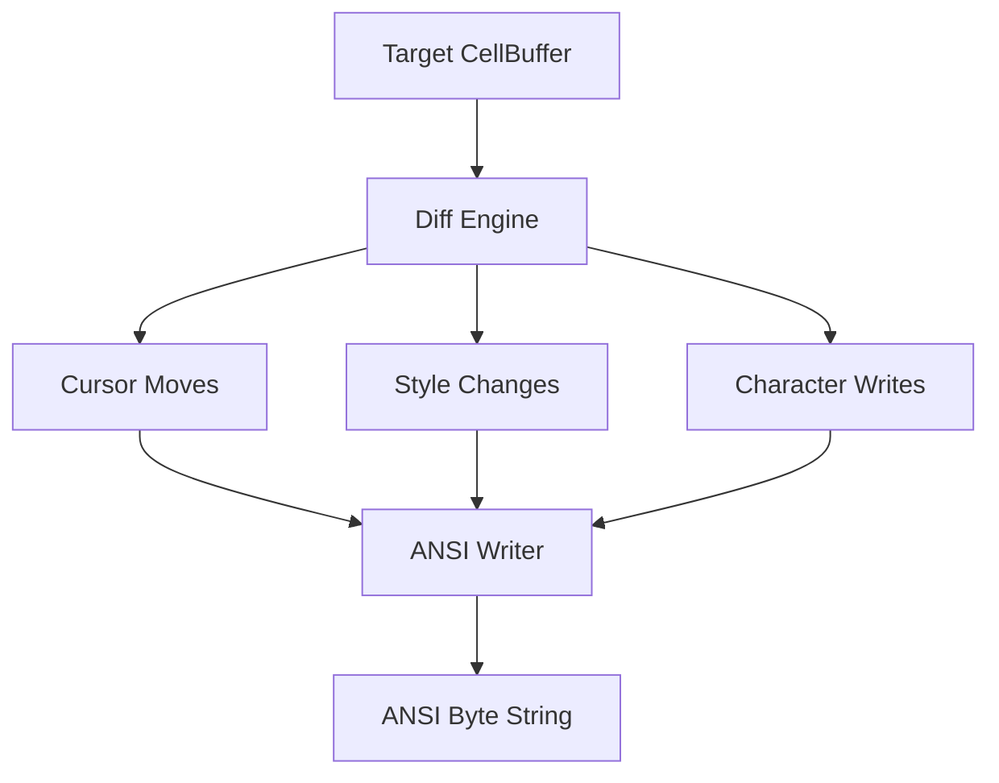

# task-3-4

## Identity

| Field          | Value                       |
|----------------|-----------------------------|
| Type           | Story                       |
| Title          | Diff Engine and ANSI Writer |
| Parent Feature | task-3                      |
| Children Tasks | task-3-4-1, task-3-4-2      |

## Logical Flow

After painting the desired frame into the target buffer, the engine must update the terminal with as few bytes as possible. This story implements the diff engine and ANSI writer: the diff engine compares the target and current buffers cell-by-cell, and the ANSI writer converts those differences into terminal control sequences.

## Objective

Implement buffer diffing and ANSI sequence generation:
- Compare the target and current buffers index-by-index.
- Emit cursor positioning only when needed.
- Emit style changes only when the active style differs.
- Convert diff operations into ANSI escape sequences.

## Scope Boundary

- Deliverable this story introduces:
  - `DiffEngine` that scans two `CellBuffer` instances.
  - Representation of diff operations (cursor move, style change, write cell).
  - `AnsiWriter` that generates SGR and CSI cursor sequences from `Cell` values.
  - Copy of the target buffer into the current buffer after diffing.

Out of scope (to be handled in child tasks):

- Writing the generated ANSI bytes to stdout.
- Terminal capability detection or color-depth negotiation.
- Complex run-length or region-based diff optimization.

## Acceptance Criteria

- All children tasks are completed and accepted.
- The diff engine identifies only mismatched cells.
- Cursor positioning is emitted when the write position changes non-sequentially.
- Style sequences are emitted only on style transitions.
- The current buffer is updated to match the target buffer after diffing.
- Unit tests verify diff output and ANSI sequence generation.

## How

Implement a sequential diff that walks the flat buffer from index 0 to `width * height - 1`. Track the current cursor position and active style. When a cell differs from the current display, move the cursor if the next write position is not the natural next cell, update the active style if the cell style differs, and write the character. After the scan, deep-copy the target buffer into the current buffer. The `AnsiWriter` translates `Cell` style flags and colors into SGR codes and cursor moves into CSI sequences.

## Why

Efficient terminal output is essential for a responsive TUI. A sequential diff with style state tracking keeps the implementation simple while producing minimal output, which is especially important without raw mode and with potentially line-buffered stdout.
