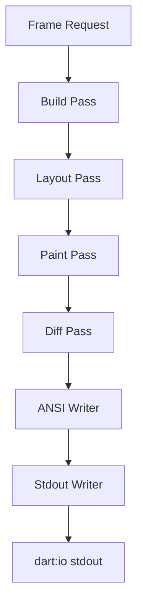

# task-3-5

## Identity

| Field          | Value                              |
|----------------|------------------------------------|
| Type           | Story                              |
| Title          | Stdout Writer and Pipeline Integration |
| Parent Feature | task-3                             |
| Children Tasks | task-3-5-1                         |

## Logical Flow

The individual render passes are only useful once they are orchestrated into a complete pipeline and the resulting ANSI bytes are flushed to the terminal. This story wires the build, layout, paint, diff, and flush steps together and writes the generated output to `dart:io` stdout.

## Objective

Integrate the full rendering pipeline and flush output to stdout:
- Create a `StdoutWriter` abstraction around `dart:io` stdout.
- Implement a `Pipeline` that orchestrates the render passes.
- Trigger the pipeline on frame requests from the scheduler.

## Scope Boundary

- Deliverable this story introduces:
  - `StdoutWriter` that wraps `IOSink` and flushes generated ANSI strings.
  - `Pipeline` class exposing a `render` or `run` method.
  - `Scheduler` integration that requests frames and drives the pipeline.
  - End-to-end smoke test that renders a full-screen `Text` widget.

Out of scope (to be handled in child tasks):

- Reading real stdin input.
- ANSI event parsing.
- Raw terminal mode or alternate buffer.

## Acceptance Criteria

- All children tasks are completed and accepted.
- The pipeline runs all five passes in order for each frame.
- `StdoutWriter` writes the generated ANSI string and flushes the sink.
- The scheduler can trigger repeated frames.
- Unit and/or integration tests verify end-to-end output.

## How

Create a `Pipeline` class that owns the target and current `CellBuffer` instances, an `AnsiWriter`, and a `StdoutWriter`. Its `render(Widget root, TuiSize size)` method runs build, layout, paint, diff, and flush in sequence. The `StdoutWriter` wraps `dart:io` stdout, writes the ANSI string, and calls `flush()`. The `Scheduler` exposes a `requestFrame(VoidCallback callback)` API and invokes the pipeline callback when a frame is due.

## Why

This story closes the output side of the framework. Without pipeline integration, the preceding passes would be isolated units; with it, the framework can render a declarative widget to the terminal in response to state changes.
