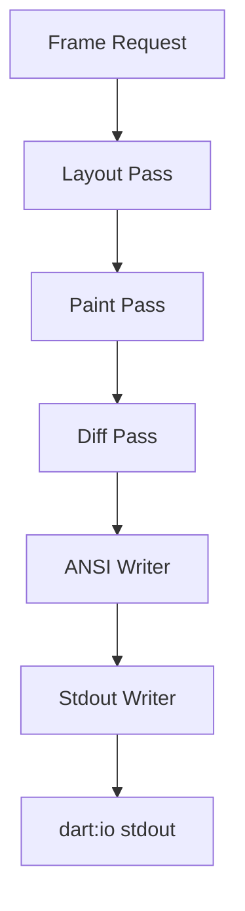

# task-3-5

## Identity

| Field          | Value                              |
|----------------|------------------------------------|
| Type           | Story                              |
| Title          | Pipeline Integration and Flush     |
| Parent Feature | task-3                             |
| Children Tasks | task-3-5-1                         |

## Logical Flow

The individual render passes are only useful once they are orchestrated into a complete pipeline and the resulting ANSI bytes are flushed to the terminal. This story wires the layout, paint, diff, and flush steps together and writes the generated output to `dart:io` stdout.

## Objective

Integrate the full rendering pipeline and flush output to stdout:
- Create a `StdoutWriter` abstraction around `dart:io` stdout.
- Implement a `Pipeline` that orchestrates the render passes.
- Expose a simple entry point for driving frames directly.

## Scope Boundary

- Deliverable this story introduces:
  - `StdoutWriter` that wraps `IOSink` and flushes generated ANSI strings.
  - `Pipeline` class exposing a `render` or `run` method.
  - End-to-end smoke test that renders a full-screen `RenderText` through `RenderRoot`.

Out of scope (to be handled in child tasks):

- Reading real stdin input.
- ANSI event parsing.
- Widget/Element/BuildContext abstractions (Milestone 5).
- Raw terminal mode or alternate buffer.

## Acceptance Criteria

- All children tasks are completed and accepted.
- The pipeline runs all four passes in order for each frame.
- `StdoutWriter` writes the generated ANSI string and flushes the sink.
- Unit and/or integration tests verify end-to-end output.

## How

Create a `Pipeline` class that owns the target and current `CellBuffer` instances, an `AnsiWriter`, and a `StdoutWriter`. Its `render(RenderObject root, Size size)` method runs layout, paint, diff, and flush in sequence. The `StdoutWriter` wraps `dart:io` stdout, writes the ANSI string, and calls `flush()`. For this milestone the render tree is constructed directly in tests and frames are driven by calling `Pipeline.render`; in later milestones it will be produced by the widget/element layer and driven by provider change notifications.

## Why

This story closes the output side of the framework. Without pipeline integration, the preceding passes would be isolated units; with it, the framework can render a declarative render tree to the terminal in response to frame requests, forming the foundation for the future three-tree architecture.
