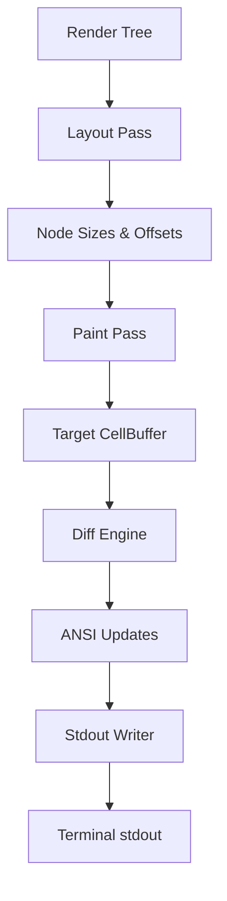

# task-3

## Identity

| Field            | Value                                                              |
|------------------|--------------------------------------------------------------------|
| Type             | Feature                                                            |
| Title            | Rendering Pipeline                                                 |
| Children Stories | task-3-1, task-3-2, task-3-3, task-3-4, task-3-5                   |

## Logical Flow

This feature implements the engine that converts a declarative render tree into terminal output. It is the TUI equivalent of Flutter's rendering layer: a tree of long-lived `RenderObject`s performs a two-pass constraint layout, paints immutable `Cell` values into a target buffer, and the engine diffs and flushes the result to stdout.

In the full framework vision, this render tree will later be driven by a Widget tree and an Element tree introduced in Milestone 5. Milestone 3 owns the render tree itself and the pipeline that turns it into terminal bytes.

## Objective

Implement the rendering engine that turns a render tree into terminal output:
- A `RenderObject` abstraction that represents a node in the render tree.
- A two-pass constraint layout pass: constraints flow down, sizes flow up.
- A paint pass that writes immutable `Cell` values into a target `CellBuffer`.
- A diff engine that compares buffers and produces minimal updates.
- An `AnsiWriter` that generates style and cursor sequences.
- A `StdoutWriter` that flushes the generated output to `dart:io` stdout.

## Scope Boundary

- Render tree abstractions (`RenderObject`, `RenderText`, `RenderRoot`).
- Two-pass integer-cell constraint layout.
- Paint pass writing into a `CellBufferBuilder` and building the immutable target `CellBuffer`.
- Sequential diff engine over flat cell buffers.
- `AnsiWriter` for SGR and cursor-positioning sequences.
- `StdoutWriter` and pipeline orchestration.
- Unit tests verifying each pass and end-to-end output.

Out of scope (to be handled in later milestones):

- Widget tree, Element tree, and `BuildContext` (Milestone 5).
- `StatelessWidget`, `StatefulWidget`, `State`, and `setState` (Milestone 5).
- Real stdin input and ANSI event parsing (Milestone 4).
- Raw terminal mode, alternate buffer, or mouse events.
- Terminal capability detection or resize handling.
- Advanced multi-child layout widgets (Flex, Row, Column, etc.).

## Acceptance Criteria

- All children stories are completed and accepted.
- The pipeline runs Layout → Paint → Diff → Flush end-to-end.
- Only changed cells generate ANSI output.
- Style sequences are emitted only when the active style changes.
- Render objects respect the two-pass constraint protocol.
- All new code is covered by unit tests where behavior is non-trivial.

## How

Define a `RenderObject` base class that owns size, offset, and parent/child relationships. Subclasses implement `performLayout(Constraints)` to enforce the two-pass protocol and `paint(CellBuffer, Offset)` to write cells. The pipeline accepts a root render object and terminal size, runs layout with tight terminal constraints, paints into a fresh target buffer, diffs against the current display buffer, converts deltas into ANSI sequences, and flushes them through a thin `StdoutWriter`. The abstraction is designed so that a future Widget/Element layer can create and update the same render objects.

## Why

The render tree and pipeline are the core output path of the framework. By modeling the render layer after Flutter's `RenderObject` architecture, the framework gains a clear separation between configuration (widgets, later), lifecycle (elements, later), and layout/paint (render objects, now). This makes the eventual three-tree architecture a natural extension rather than a rewrite.
