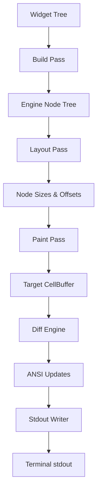

# task-3

## Identity

| Field            | Value                                                              |
|------------------|--------------------------------------------------------------------|
| Type             | Feature                                                            |
| Title            | Rendering Pipeline                                                 |
| Children Stories | task-3-1, task-3-2, task-3-3, task-3-4, task-3-5                   |

## Logical Flow

This feature implements the engine that converts a declarative widget tree into terminal output through a sequence of passes: build, layout, paint, diff, and flush. Each pass is independent and operates on lightweight, immutable data structures.

## Objective

Implement the rendering engine that turns a widget tree into terminal output:
- A build pass that compiles widgets into engine nodes.
- A simplified layout pass that computes sizes and offsets.
- A paint pass that writes immutable `Cell` values into a target `CellBuffer`.
- A diff engine that compares buffers and produces minimal updates.
- An `AnsiWriter` that generates style and cursor sequences.
- A `StdoutWriter` that flushes the generated output to `dart:io` stdout.

## Scope Boundary

- Build pass and engine node abstractions.
- Simplified integer-cell layout pass.
- Paint pass writing into the target `CellBuffer`.
- Sequential diff engine over flat cell buffers.
- `AnsiWriter` for SGR and cursor-positioning sequences.
- `StdoutWriter` and pipeline orchestration.
- Unit tests verifying each pass and end-to-end output.

Out of scope (to be handled in child stories and later milestones):

- Real stdin input and ANSI event parsing.
- Widgets other than `Text` for this milestone.
- Raw terminal mode, alternate buffer, or mouse events.
- Terminal capability detection or resize handling.
- Advanced constraint-based layout (Flex, Row, etc.).

## Acceptance Criteria

- All children stories are completed and accepted.
- The pipeline runs Build → Layout → Paint → Diff → Flush end-to-end.
- Only changed cells generate ANSI output.
- Style sequences are emitted only when the active style changes.
- All new code is covered by unit tests where behavior is non-trivial.

## How

Define a base `Widget` and a lightweight runtime `Node`/`Element` abstraction. The pipeline accepts a root widget and terminal size, compiles it to nodes, recursively lays out the node tree with top-down constraints and bottom-up sizes, paints immutable `Cell` objects into a flat target buffer, diffs the target against the current display buffer, converts the deltas into ANSI sequences, and flushes them through a thin `StdoutWriter`. Each pass is isolated and tested independently before integration.

## Why

The rendering pipeline is the core output path of the framework. It is the bridge between declarative widgets and the terminal, and it must be efficient, testable, and deterministic before higher-level widgets and input handling are layered on top.
