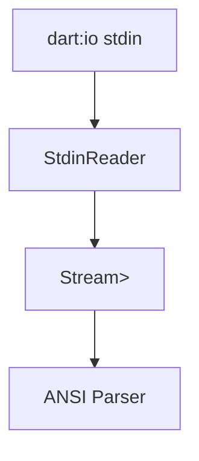

# task-4-1

## Identity

| Field          | Value                       |
|----------------|-----------------------------|
| Type           | Story                       |
| Title          | StdinReader Byte Stream     |
| Parent Feature | task-4                      |
| Children Tasks | task-4-1-1                  |

## Logical Flow

Keyboard input reaches the process as bytes on `dart:io` `stdin`. This story wraps that source into a controllable async byte stream so the parser and state graph can consume terminal input without direct `stdin` dependencies.

## Objective

Create a `StdinReader` that wraps `stdin` and exposes its bytes as an async stream.

## Scope Boundary

- Deliverable this story introduces:
  - `StdinReader` class in `lib/src/io/stdin_reader.dart`.
  - Async `Stream<List<int>>` backed by `stdin`.
  - Clean close/cancel behavior.

Out of scope (to be handled in child tasks):

- ANSI parsing or event typing.
- Raw mode configuration.
- Line-buffering workarounds.

## Acceptance Criteria

- All children tasks are completed and accepted.
- `StdinReader` exposes a non-broadcast async byte stream.
- The stream ends when `stdin` closes or the reader is disposed.
- The reader can be tested with a fake `Stream<List<int>>`.

## How

Implement `StdinReader` as a thin wrapper around `stdin`, exposing `Stream<List<int>> get bytes`. Provide a `dispose()` method that cancels the subscription. Keep it free of parsing logic so it can be unit-tested by injecting a mock stream.

## Why

Isolating byte acquisition from parsing makes the parser testable with synthetic byte sequences and lets the framework later swap the underlying input source without changing higher layers.
