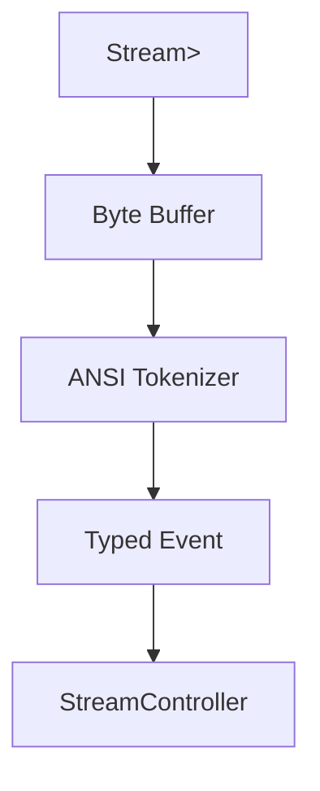

# task-4-2

## Identity

| Field          | Value                                  |
|----------------|----------------------------------------|
| Type           | Story                                  |
| Title          | ANSI/VT100 Input Parser                |
| Parent Feature | task-4                                 |
| Children Tasks | task-4-2-1, task-4-2-2                 |

## Logical Flow

Raw bytes from `stdin` are mostly ANSI escape sequences for special keys and control characters. This story implements a parser that consumes a byte stream and emits strongly-typed input events for the application state graph.

## Objective

Build a basic ANSI/VT100 parser that converts byte sequences into typed input events.

## Scope Boundary

- Deliverable this story introduces:
  - Sealed/freezed `InputEvent` hierarchy (e.g., `CharEvent`, `KeyEvent`, `UnknownEvent`).
  - `AnsiParser` that accepts byte chunks and emits `InputEvent` objects.
  - Support for printable characters, escape sequences, and common control keys.

Out of scope (to be handled in child tasks):

- Mouse, focus, bracketed-paste sequences.
- Resize or terminal-query responses.
- Full Unicode grapheme clustering.

## Acceptance Criteria

- All children tasks are completed and accepted.
- The parser emits a `CharEvent` for plain UTF-8 characters.
- Common CSI escape sequences produce appropriate `KeyEvent`s.
- Partial sequences are buffered until complete or invalidated.
- The parser stream can be tested with synthetic byte inputs.

## How

Define an immutable event model, then implement a state machine that buffers incoming bytes, detects escape sequences, and maps recognized sequences to events. Unrecognized sequences fall back to `UnknownEvent` carrying the raw bytes. The parser exposes its output as a `Stream<InputEvent>`.

## Why

A typed event boundary insulates the application from terminal protocol details and provides a stable contract for the synchronous state bridge implemented in Milestone 2.
