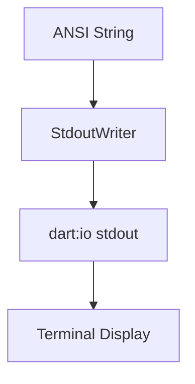

# task-4-3

## Identity

| Field          | Value                       |
|----------------|-----------------------------|
| Type           | Story                       |
| Title          | StdoutWriter                |
| Parent Feature | task-4                      |
| Children Tasks | task-4-3-1                  |

## Logical Flow

After the diff engine generates ANSI updates, the framework must send them to the terminal. This story binds the engine output to `dart:io` `stdout` through a small `StdoutWriter`.

## Objective

Implement a `StdoutWriter` that flushes generated ANSI output to `stdout`.

## Scope Boundary

- Deliverable this story introduces:
  - `StdoutWriter` class in `lib/src/io/stdout_writer.dart`.
  - Method to write an ANSI string and flush it.
  - Optional abstraction to support test doubles.

Out of scope (to be handled in child tasks):

- ANSI sequence generation.
- Diff engine integration details.
- Buffering strategies beyond a single flush.

## Acceptance Criteria

- All children tasks are completed and accepted.
- `StdoutWriter` writes the provided string to `stdout`.
- Output is flushed immediately after writing.
- The writer can be tested with a fake buffer.

## How

Create a `StdoutWriter` class that wraps an `IOSink` (defaulting to `stdout`). Expose a `write(String output)` method that writes and flushes the string. Keep the class small so the engine can inject it without extra dependencies.

## Why

Isolating terminal output behind a writer keeps the engine pipeline platform-agnostic and testable. A fake writer can capture frames in tests, while the real writer sends bytes to the terminal.
