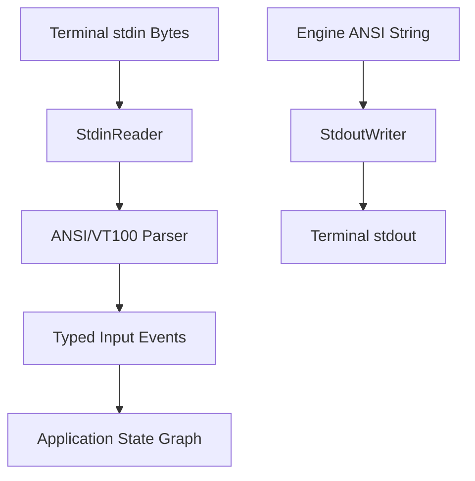

# task-4

## Identity

| Field            | Value                                                   |
|------------------|---------------------------------------------------------|
| Type             | Feature                                                 |
| Title            | Terminal I/O Without Raw Mode                           |
| Children Stories | task-4-1, task-4-2, task-4-3                            |

## Logical Flow

This feature closes the framework's terminal I/O loop using only `dart:io`. Bytes read from `stdin` are streamed through a `StdinReader`, parsed by a basic ANSI/VT100 parser into typed input events, and surfaced to the application state graph. On the output side, the engine's generated ANSI strings are flushed to `stdout` through a `StdoutWriter`.

## Objective

Provide terminal input and output adapters that operate without raw mode:
- A `StdinReader` that exposes `stdin` as an async byte stream.
- A basic ANSI/VT100 parser that converts byte sequences into typed input events.
- A `StdoutWriter` that flushes generated ANSI output to `stdout`.

## Scope Boundary

- Wrapping `dart:io` `stdin` as an asynchronous byte stream.
- Basic ANSI/VT100 parsing of key and control sequences.
- Typed input event model for keyboard input.
- Writing and flushing ANSI output to `dart:io` `stdout`.
- Unit tests for reader, parser, and writer behavior.

Out of scope (to be handled in child stories and later milestones):

- Raw terminal mode, line discipline changes, or alternate screen buffer.
- Mouse, focus, bracketed-paste, and resize events.
- Full terminal capability or color-depth detection.
- Complex multi-byte encoding beyond the parser's supported subset.

## Acceptance Criteria

- All children stories are completed and accepted.
- `StdinReader` produces a continuous async stream of byte chunks from `stdin`.
- The ANSI parser emits typed events for supported sequences.
- `StdoutWriter` writes the full frame string to `stdout` and flushes it.
- All new code is covered by unit tests where behavior is non-trivial.

## How

Create a thin `lib/src/io/` layer that isolates all `dart:io` terminal interactions. `StdinReader` listens to `stdin` and emits `List<int>` byte chunks. `AnsiParser` consumes those chunks, tokenizes escape sequences, and emits sealed input events such as `KeyEvent` and `CharEvent`. `StdoutWriter` accepts a `String` of ANSI sequences and writes it to `stdout`, then flushes. Each component is independently unit-testable by injecting fake streams or buffers.

## Why

The framework needs a deterministic boundary around terminal I/O so that higher layers can treat input as typed events and output as a simple flush operation. Keeping raw mode out of this milestone preserves portability and avoids platform-specific terminal configuration while still enabling a full end-to-end demo.
