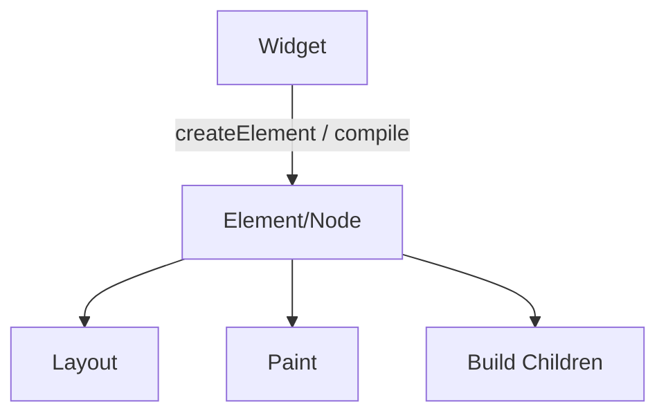

# task-5-1

## Identity

| Field          | Value                          |
|----------------|--------------------------------|
| Type           | Story                          |
| Title          | Base Widget and Node Abstractions |
| Parent Feature | task-5                         |
| Children Tasks | task-5-1-1, task-5-1-2, task-5-1-3 |

## Logical Flow

Developers describe the UI with immutable `Widget` objects. The engine converts each widget into a lightweight runtime `Element`/`Node` that can be laid out and painted. This story defines the contract between the declarative widget layer and the engine runtime.

## Objective

Create the base abstractions that connect the declarative widget API to the rendering engine.

## Scope Boundary

- Deliverable this story introduces:
  - `Widget` base class in `lib/src/view/widget.dart`.
  - `Element`/`Node` runtime abstraction in `lib/src/view/widget.dart` or a dedicated engine node file.
  - Build contract that turns a widget into a node.
  - Lifecycle hooks for layout and paint.

Out of scope (to be handled in child tasks):

- Concrete widget implementations such as `Text`.
- Provider access and `TuiContext` integration.
- Full-screen root sizing logic.

## Acceptance Criteria

- All children tasks are completed and accepted.
- A widget can be compiled into a node.
- Nodes expose layout and paint entry points.
- The abstractions are tested with a minimal stub widget.

## How

Introduce an abstract `Widget` class with an immutable identity and a method to create its corresponding `Element`/`Node`. Define a lightweight `Element`/`Node` base class that stores the widget reference, parent/child relationships, computed size and offset, and methods for `layout` and `paint`. Keep the initial design minimal; advanced lifecycle, dirty tracking, and reparenting are deferred.

## Why

These abstractions form the bridge between the developer-facing widget API and the engine. A clean, minimal contract keeps later widgets simple and makes the engine pipeline agnostic of specific widget types.
