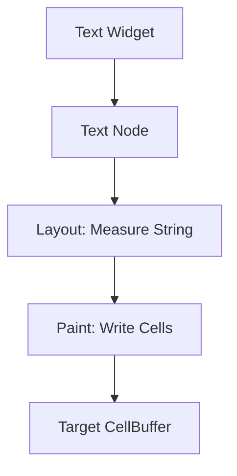

# task-5-2

## Identity

| Field          | Value                       |
|----------------|-----------------------------|
| Type           | Story                       |
| Title          | Text Widget                 |
| Parent Feature | task-5                      |
| Children Tasks | task-5-2-1, task-5-2-2, task-5-2-3 |

## Logical Flow

A `Text` widget carries a string and optional style attributes. During build it compiles into a node that, during layout, measures the number of terminal cells required, and during paint, writes one immutable `Cell` per visible character into the target buffer.

## Objective

Implement the first concrete widget: a `Text` widget that renders a string within its allocated terminal rectangle.

## Scope Boundary

- Deliverable this story introduces:
  - `Text` widget class in `lib/src/view/components/text.dart`.
  - Text layout that reports the exact cell size needed.
  - Text paint that writes immutable `Cell` values into the buffer.
  - Basic style attributes such as foreground, background, and flags.

Out of scope (to be handled in child tasks):

- Text wrapping, truncation, and overflow handling beyond simple clip.
- Multi-line text and line breaking.
- Unicode width handling beyond one code point per cell.

## Acceptance Criteria

- All children tasks are completed and accepted.
- `Text` renders its string inside the allocated rectangle.
- Style attributes are reflected in emitted `Cell` values.
- Layout reports the correct terminal-cell size.
- Unit tests verify rendering output for sample strings.

## How

Define a `Text` widget that holds a `String` and optional `Cell`-style attributes. Its node measures the string length as the desired width and one cell as the desired height. During paint, iterate over the characters and write immutable `Cell` objects into the target `CellBuffer` at the node's offset, applying the configured style. Clip characters that exceed the allocated width.

## Why

`Text` is the smallest useful widget and the first deliverable mentioned in the project vision. Implementing it validates the widget-to-node contract, layout semantics, and paint path before more complex widgets are introduced.
