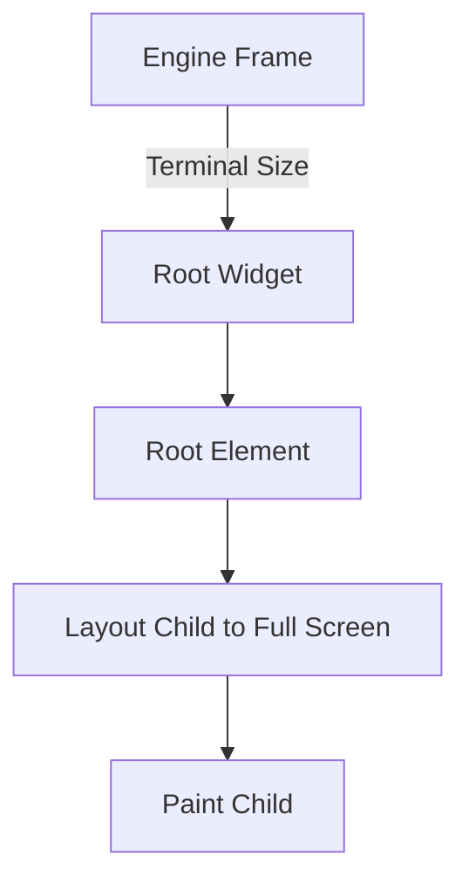

# task-5-3

## Identity

| Field          | Value                       |
|----------------|-----------------------------|
| Type           | Story                       |
| Title          | Full-Screen Root Widget     |
| Parent Feature | task-5                      |
| Children Tasks | task-5-3-1, task-5-3-2, task-5-3-3 |

## Logical Flow

The engine knows the terminal size. It constructs a full-screen root widget that receives this size and lays out its child to fill the available area. The root widget binds the developer-declared widget tree to the engine frame lifecycle.

## Objective

Create a full-screen root widget / scaffold that fills the terminal and hosts the application widget tree.

## Scope Boundary

- Deliverable this story introduces:
  - Root widget class in `lib/src/view/components/root.dart` or similar.
  - Root element that receives the terminal size from the engine.
  - Layout behavior that sizes the child to the full terminal rectangle.
  - Integration point with the engine pipeline.

Out of scope (to be handled in child tasks):

- Resize handling and dynamic terminal size changes.
- Alternate screen buffer or raw mode.
- Padding, margin, or decorative borders.

## Acceptance Criteria

- All children tasks are completed and accepted.
- The root widget fills the full terminal width and height.
- The child widget is laid out with the full terminal size as its constraint.
- The root integrates cleanly with the engine pipeline.
- Unit tests verify full-screen sizing behavior.

## How

Define a root widget that accepts a single child and is constructed by the engine with the current terminal size. Its element stores the terminal size, passes it as a constraint during layout, and positions the child at offset `(0, 0)` with the same size. During paint it delegates to the child. Keep the root as a thin adapter so the engine controls sizing while the application controls content.

## Why

Every frame needs a known origin and bounds. The root widget provides that boundary without leaking engine internals into application code, and it is the foundation for later resize-aware behavior.
