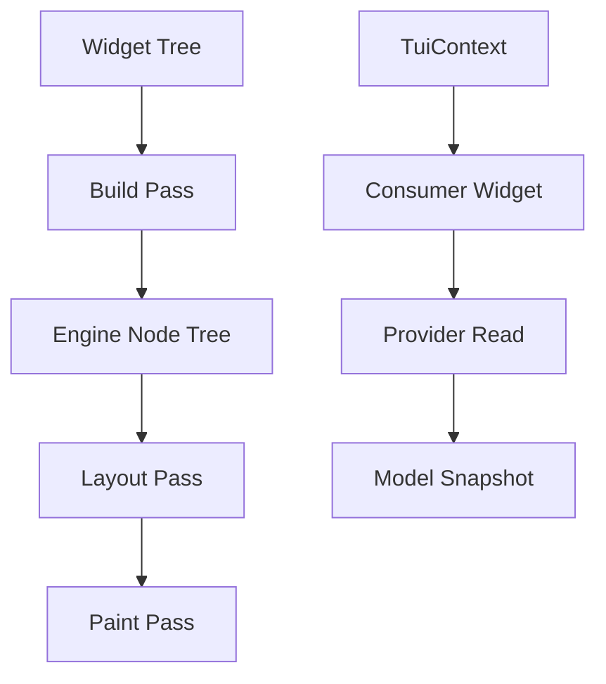

# task-5

## Identity

| Field            | Value                                                   |
|------------------|---------------------------------------------------------|
| Type             | Feature                                                 |
| Title            | Declarative Widgets                                     |
| Children Stories | task-5-1, task-5-2, task-5-3, task-5-4, task-5-5        |

## Logical Flow

This feature introduces the public declarative widget layer. Application developers describe the terminal UI as an immutable widget tree. Each widget compiles into a lightweight engine node that participates in build, layout, and paint. The root widget binds the tree to the full terminal size, while a `Consumer`-like widget lets nodes read Riverpod providers through a `TuiContext`.

## Objective

Provide the first public widget set and root binding:
- Base `Widget` and `Element`/`Node` abstractions.
- A `Text` widget that renders a string of characters.
- A full-screen root widget / scaffold that fills the terminal.
- A `TuiContext` that exposes provider access during the build pass.
- A `Consumer`-like widget for reading Riverpod providers declaratively.

## Scope Boundary

- Base widget and node abstractions.
- `Text` widget implementation.
- Full-screen root widget sizing and binding.
- `TuiContext` and provider access bridge.
- `Consumer` widget for provider-driven subtrees.
- Unit tests for widget compilation and rendering.

Out of scope (to be handled in child stories and later milestones):

- Flex, Row, Column, and advanced layout widgets.
- Complex constraint-based layout negotiation.
- Raw terminal mode, mouse, or alternate buffer handling.
- Animation, theming, and styling systems beyond basic `Cell` attributes.

## Acceptance Criteria

- All children stories are completed and accepted.
- A widget tree can be declared, built, laid out, and painted end-to-end.
- `Text` renders its content within its allocated rectangle.
- The root widget fills the full terminal width and height.
- `Consumer` rebuilds when the observed provider changes.
- All new code is covered by unit tests where behavior is non-trivial.

## How

Define an immutable `Widget` base class with a `build` or `compile` method that produces an engine `Element`/`Node`. Nodes carry immutable configuration and implement layout and paint callbacks. `TuiContext` wraps a Riverpod `ProviderContainer` (or equivalent) and is passed through the build pass so widgets can read providers. The root widget is a special full-screen widget that receives the terminal size from the engine and sizes its child to match. `Consumer` takes a provider and a builder function, reads the provider value during build, and rebuilds when the provider notifies listeners.

## Why

The widget layer is the primary public API surface of the framework. It must be declarative, immutable, and provider-driven so that application code can describe a terminal UI without managing the rendering pipeline directly. Establishing these abstractions now enables later widgets such as Flex, Row, and interactive controls to be built on the same foundation.
