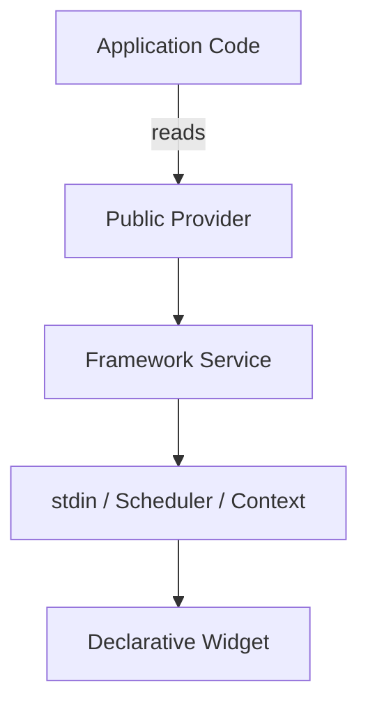

# task-6-1

## Identity

| Field          | Value                                  |
|----------------|----------------------------------------|
| Type           | Story                                  |
| Title          | Expose Public API Through Providers    |
| Parent Feature | task-6                                 |
| Children Tasks | task-6-1-1, task-6-1-2, task-6-1-3     |

## Logical Flow

Application developers should interact with the framework through Riverpod providers rather than by constructing engine classes directly. This story identifies the framework services that must be publicly reachable and wraps them in typed providers that can be read from widgets and ViewModels.

## Objective

Promote Riverpod providers to the primary public API surface for framework services and state access.

## Scope Boundary

- Deliverable this story introduces:
  - Public providers for terminal input events, terminal size, frame scheduler, and `TuiContext`.
  - Provider factories that keep application code free of direct engine class construction.
  - Unit tests verifying provider exposure and watchability.

Out of scope (to be handled in child tasks):

- Internal provider wiring for engine-only use.
- Renaming or redesigning existing providers.
- Documentation or example usage.

## Acceptance Criteria

- All children tasks are completed and accepted.
- Public providers expose the framework services needed for a full-screen text application.
- Application code can read these providers through `TuiContext` or a `ProviderContainer`.
- Provider changes correctly trigger widget rebuilds via `Consumer`.
- Tests verify provider creation, reading, and notification behavior.

## How

Audit the framework services produced in earlier milestones (stdin event stream, terminal size, frame scheduler, `TuiContext`, and any ViewModel integration points). For each service that application code needs, define a public Riverpod provider in the appropriate `lib/src/` location and re-export it from `lib/t22e.dart`. Keep the provider definitions thin so they delegate to existing engine classes; this story is about exposure, not reimplementation.

## Why

Providers are the canonical public API of the framework. Exposing services through Riverpod keeps application code declarative, testable, and decoupled from the engine implementation, which is essential before marking the rest of the codebase as internal.
