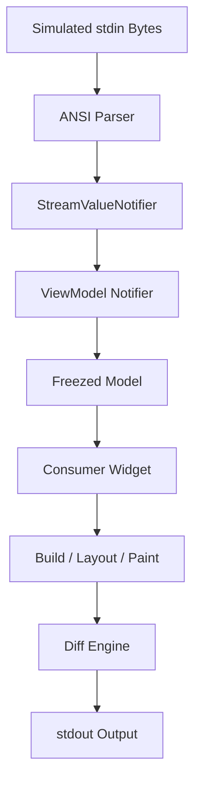

# task-6-3

## Identity

| Field          | Value                                              |
|----------------|----------------------------------------------------|
| Type           | Story                                              |
| Title          | Smoke Test: Full-Screen Text Updating on stdin     |
| Parent Feature | task-6                                             |
| Children Tasks | task-6-3-1, task-6-3-2, task-6-3-3                 |

## Logical Flow

A smoke test exercises the full pipeline: stdin bytes are parsed into typed events, the events cross the synchronous state bridge into a Riverpod ViewModel, the widget tree rebuilds, and the diff engine emits minimal ANSI updates to stdout.

## Objective

Create and run a smoke test that demonstrates the complete framework pipeline with a full-screen `Text` widget that updates in response to stdin events.

## Scope Boundary

- Deliverable this story introduces:
  - A smoke test harness in `test/` that wires stdin → state → widget → render.
  - A full-screen `Text` widget driven by a Riverpod provider.
  - Assertions for the initial render and for output after a simulated stdin event.

Out of scope (to be handled in child tasks):

- Full integration tests against a real terminal.
- Performance or GC measurements.
- Testing advanced widgets or layout features.

## Acceptance Criteria

- All children tasks are completed and accepted.
- The smoke test renders a full-screen `Text` widget.
- A simulated stdin event updates the model and causes a visible output change.
- The diff engine emits only the ANSI sequences needed for the update.
- The test passes in the CI / local `dart test` run.

## How

Build a test harness that creates a controlled stdin byte stream, an ANSI parser, a `StreamValueNotifier`, a Riverpod `Notifier` or `AsyncNotifier` ViewModel, and the rendering pipeline. Declare a full-screen root widget containing a `Consumer` that reads the ViewModel and returns a `Text` widget. Drive one or more stdin bytes through the pipeline, schedule frames, and capture the stdout output. Assert that the captured output contains the expected text and that updates are minimal.

## Why

This smoke test is the definition of done for the first phase. It proves that the individual components from earlier milestones integrate correctly and that the framework can be driven by real terminal input to produce real terminal output.
