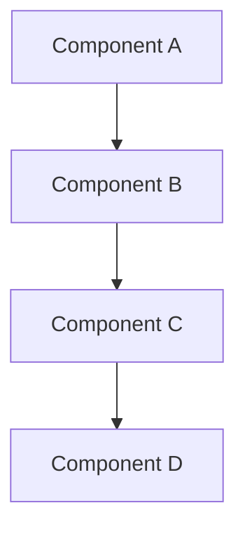
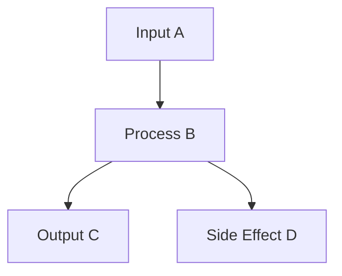

# Task File Templates for `t22e`

The project uses three task levels. The filename pattern indicates the type:

| Type        | Filename Pattern | Example       |
|-------------|------------------|---------------|
| Feature     | `task-X.md`      | `task-3.md`   |
| Story       | `task-X-Y.md`    | `task-3-5.md` |
| Simple Task | `task-X-Y-Z.md`  | `task-3-5-1.md` |

---

## Feature Task Template (`task-X.md`)

````markdown
# task-X

## Identity

| Field            | Value                     |
|------------------|---------------------------|
| Type             | Feature                   |
| Title            | [Feature Title]           |
| Children Stories | task-X-1, task-X-2, ...   |

## Logical Flow

Describe the high-level system flow or architecture this feature implements.



## Objective

Describe what this feature delivers and why it exists.

## Scope Boundary

- High-level capability this feature introduces
- High-level capability this feature introduces

Out of scope (to be handled in child stories):

- ...

## Acceptance Criteria

- All children stories are completed and accepted
- Feature integrates correctly end-to-end
- Relevant documentation is updated

## How

Describe the architectural approach, patterns, and integration strategy for this feature.

## Why

Explain the motivation, constraints, and impact of this feature on the framework.
````

---

## Story Task Template (`task-X-Y.md`)

````markdown
# task-X-Y

## Identity

| Field          | Value                       |
|----------------|-----------------------------|
| Type           | Story                       |
| Title          | [Story Title]               |
| Parent Feature | task-X                      |
| Children Tasks | task-X.Y.1, task-X.Y.2, ... |

## Logical Flow

Describe the focused logical flow or subsystem behavior this story implements.



## Objective

Describe what user or technical goal this story achieves.

## Scope Boundary

- Deliverable this story introduces
- Deliverable this story introduces

Out of scope (to be handled in child tasks):

- ...

## Acceptance Criteria

- All children tasks are completed and accepted
- Story's functionality is verified
- Tests and documentation updated if needed

## How

Describe the implementation approach and patterns for this story.

## Why

Explain why this story is needed and how it contributes to the parent feature.
````

---

## Simple Task Template (`task-X-Y-Z.md`)

````markdown
# task-X-Y-Z

## Identity

| Field        | Value         |
|--------------|---------------|
| Type         | Task          |
| Title        | [Task Title]  |
| Parent Story | task-X-Y      |

## Objective

One-sentence description of what this single-session task must accomplish.

## Scope Boundary

This task is intentionally scoped to a single focused session. It must only cover:

- `lib/src/path/to/file.dart`: describe what to create or change
- `lib/src/path/to/file2.dart`: describe what to create or change

Out of scope (to be handled in later tasks):

- ...

## API References

- Dart API: [link to relevant Dart documentation]
- Package API: [link to relevant package documentation, if applicable]

## Acceptance Criteria

- Criterion 1
- Criterion 2
- All new code follows the existing project style and passes static analysis
- Unit tests added or updated and passing, if applicable

## How

Describe the implementation approach without including code snippets.

## Why

Explain why this specific task is needed and how it contributes to the parent story.
````
